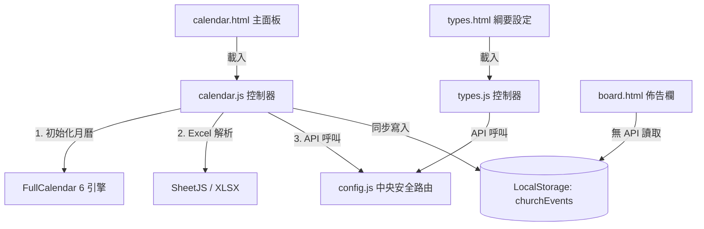
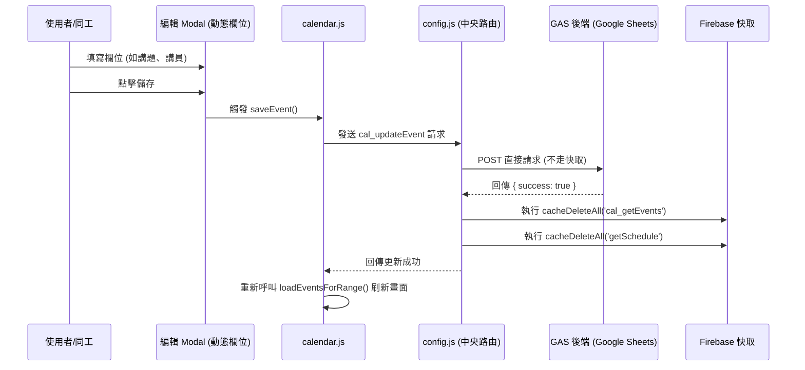

# 教會行事曆系統 — 前端 ARCHITECTURE.md

本專案為林口教會（LKC）主要行事曆與事項管理系統的前端 Web 應用程式，部署於 GitHub Pages。本系統提供行事曆視覺化檢視（FullCalendar 6）、事項類別與自訂欄位綱要設定、Excel 批次匯入、AI 週報語意解析，以及聚會佈告欄展示功能。

---

## 系統定位與依存關係

### 1. 系統定位
本系統（`LKC_MasterSchedule`）供教會行政同工、事工領袖與一般會友使用。同工可在此管理全年度的所有聚會、特會與活動，並可彈性定義每一種聚會類型（如：主日禮拜、禱告會、查經班）應該填寫的專屬欄位（如：講題、講員、宣召經文、音控同工）。一般會友與現場螢幕則可透過佈告欄模式（`board.html`）快速瀏覽近期聚會資訊。

### 2. 依存金鑰與路由設定
* **_GAS_KEY**：宣告為 `LKC_MasterSchedule`（測試環境自動切換為 `LKC_MasterSchedule_TEST`）。
* **中央安全路由**：引用根目錄 `../../config.js`，對應 GAS 後端實體：
  * 生產環境：`https://script.google.com/macros/s/AKfycbwiYYWgKxmLRAEaE_pbp_kWyAzlRPcwYVQfvmJVamRJvosvt5wTTkvwebbFBkP8rMqX/exec`
  * 測試與合併環境：`https://script.google.com/macros/s/AKfycbxBOFeLiXu23kBMGU8iSvRyJci6fruTfk7HdahhcQFY777sCPSgasuNM7Z1CeuzuS-r/exec`
* **Token 驗證**：自動注入 `ChurchApp-2026`。

---

## 檔案結構與 UI 職責

專案中共有 7 個主要檔案，職責分配如下：

### 1. 頁面重定向與大廳
* `index.html`：入口檔案，包含 HTTP meta-refresh 與 JavaScript `window.location.replace` 邏輯，立即將使用者重定向至 `calendar.html`。
* `README.md`：簡短的專案說明文件。

### 2. 行事曆主控面板
* `calendar.html`：使用者主要操作介面。包含：
  * **行事曆區域**：整合 FullCalendar 6（`dayGridMonth`, `timeGridWeek`, `listMonth` 檢視）。
  * **篩選控制**：依據事件類型動態渲染複選按鈕（Chips），支援單擊篩選、全選與清除篩選。
  * **多功能管理面板**：提供「新增聚會」、「批次新增」、「AI 語意生成」、「Excel 匯入」、「類別與欄位設定」等快速入口。
  * **事件詳情與編輯 Modal**：支援動態欄位輸入（依據事件類型繼承之欄位定義）。
* `calendar.js`：
  * **FullCalendar 初始化**：配置行事曆主題、時區、按鈕與語言，設定 `datesSet` 監聽器。
  * **API 請求管理**：實作 `callAPI(action, data)` 封裝，依據 `config.js` 的中央 API 呼叫後端。
  * **事件與篩選載入**：加載 `cal_getTypes` 與 `cal_getEvents`。事件載入後，會寫入 `localStorage.setItem('churchEvents', ...)` 以供 `board.html` 離線或免 API 呼叫載入。
  * **自訂欄位動態渲染**：切換事件類型時，呼叫 `cal_getFields` 並執行 `_renderFieldInput(f, value)`，根據欄位型態（文字、多行文字、日期、選項等）生成 DOM 輸入項。
  * **批次事件建立**：實作 `confirmBatchAdd`，收集多個選取日期、行程標題與欄位內容，傳送 `cal_addEventsBatch`。
  * **AI 語意解析**：同工將文字（如週報內容）貼入，點擊「開始 AI 解析」，發送 `cal_aiParseForType`。解析成功後將回傳的結構化事件數組生成預覽卡片，支援編輯並呼叫 `cal_addEventsBatch` 存檔。
  * **Excel 匯入**：使用 SheetJS 載入 Excel 檔案（.xlsx），自動比對標題列，檢驗日期格式與欄位對照，批次提交 `cal_addEventsBatch`。
  * **範本下載**：透過 `downloadSermonTemplate` 動態產生包含指定類型欄位（Header）的 CSV/Excel 範本供使用者下載。

### 3. 分類與欄位設定
* `types.html`：事項類別與欄位設定的管理頁面。
* `types.js`：
  * **類別樹管理**：載入類別樹並以遞迴方式渲染（`_renderTypeNode`），支援類別的 CRUD（`cal_addType`, `cal_updateType`, `cal_deleteType`）。
  * **自訂欄位定義**：編輯某類別的欄位配置。可新增/修改/刪除欄位（`cal_addField`, `cal_updateField`, `cal_deleteField`、`cal_reorderFields`）。
  * **繼承欄位處理**：子類別會自動繼承父類別的欄位。提供開關按鈕（`toggleInheritedField`）讓子類別能排除或啟用特定的繼承欄位。
  * **資料庫初始化與移轉**：提供一鍵初始化 Sheet 綱要（`cal_setupSchema`）與舊版資料移轉（`cal_migrateOldData`）功能。

### 4. 近期聚會佈告欄 (免 API 獨立版)
* `board.html`：極簡、卡片式排版的近期聚會展示看板。
  * **資料來源**：完全不依賴即時 API，而是從 `localStorage.getItem('churchEvents')` 取得行事曆主程式寫入的緩存資料。
  * **過濾與排序**：過濾出大於等於今日的聚會事件，依日期升冪排序。
  * **講道細節渲染**：針對有 `sermons` 講道資訊的事件（如台語禮拜、華語禮拜），以不同色彩標籤區分華語/台語，展示講題、講員、經文、宣召與金句。

---

## 核心業務流程與 API 呼召

### 1. 行事曆事件查詢與快取
1. `calendar.js` 的 FullCalendar 偵測到使用者切換月份（觸發 `datesSet`）。
2. 計算當前視區的 `startDate` 與 `endDate`。
3. 呼叫 `cal_getEvents` 取得區間內的所有事項。
4. 由於 `cal_getEvents` 在 `config.js` 的 `_CACHEABLE_ACTIONS` 中，系統會優先從 Firebase RTDB 讀取。若無快取，則呼叫 GAS 後端下載，並以 TTL 21600 秒（6 小時）快取。
5. 前端將取得的事件解析並複製一份存入 `localStorage.churchEvents`，再將事件渲染至月曆畫面上。

### 2. AI 語意生成事件流程
```text
同工貼上文字 (例如：週報程序與講道內容)
  ↓
選擇目標事項類型 (例如：主日禮拜)
  ↓
點擊「開始 AI 解析」
  ↓
呼叫後端 API [cal_aiParseForType] (不使用快取)
  ↓
GAS 串接大語言模型解析為 JSON 事件數組
  ↓
前端渲染「預覽卡片」列表 (包含講題、講員、經文等欄位)
  ↓
同工校對無誤後，點擊「確定匯入」
  ↓
呼叫後端 API [cal_addEventsBatch] 寫入 Google Sheets
  ↓
觸發 Invalidation 流程，重載行事曆
```

### 3. 快取失效聯動 (Invalidation Map)
當執行任何寫入/修改操作（例如 `cal_addEvent`、`cal_updateEvent`、`cal_deleteEvent`、`cal_addEventsBatch`）時，系統會同步清除以下快取主題：
* `cal_getEvents` (行事曆事項列表)
* `cal_getEvent` (單一事項詳情)
* `getSchedule` (敬拜團季度服事公佈欄) — *行事曆異動會影響敬拜團聚會資訊*
* `getScheduleByDateRange` (敬拜團區間服事表)

當類別或欄位變更（`cal_addType`, `cal_updateField` 等）時，會額外清除 `cal_getTypes` 與 `cal_getFields`，確保欄位定義與類型清單立即更新。

---

## 前端元件與資料流向圖

### 元件結構與 API 依賴


### 事件新增/編輯與快取失效資料流

