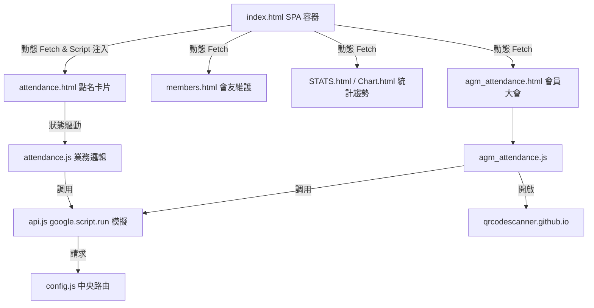
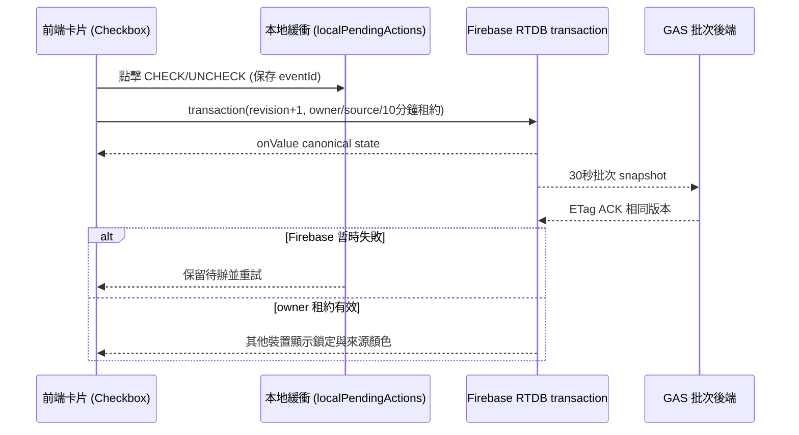

# 教會主日出席點名系統 — 前端 ARCHITECTURE.md

本專案為林口教會（LKC）主日出席點名系統的前端 Web 應用程式，部署於 GitHub Pages。它以單頁面應用程式（SPA）架構運作，並利用客製化的 GAS 橋接層與 Firebase 實時資料庫進行點名狀態同步。

## 2026-08 暫存與 ACK 同步策略

- `firebase/attendance-temp.js` 使用 Firebase RTDB `attendanceTemp/{scope}/{UID}` 作為即時暫存；scope 會區隔一般場次與 `AGM:<sessionId>`，scope + UID 是冪等鍵。
- 主日點名頁直接訂閱同一個 scope 的 Firebase `onValue`，裝置間畫面同步不等待 GAS；GAS 批次只負責把暫存落到 `SYNC_TEMP`。
- 勾選／取消先由瀏覽器以 Firebase transaction 寫入；每個 UID 具有 `revision`、`ownerId`、`source` 與 10 分鐘 `lockedUntil`。同一 owner 可直接取消預點名，其他裝置在租約有效時不能取消；取消不是直接刪除，而是保留 `checked=false` tombstone，讓舊操作不能把狀態復活。
- `source=manual` 維持青綠色，`source=qr` 使用深藍色；同狀態的重複 QR／手動點名是冪等 no-op，不會偷換 owner 或來源顏色。
- `attendance.js` 與 QR scanner 每 30 秒呼叫 GAS `flushAttendanceTemp`。Firebase 暫存保留 6 小時作為競態與離線緩衝；GAS 取得 scope lock 後讀取最新 snapshot，依 `revision` 防止舊批次覆蓋 `SYNC_TEMP`。
- scanner 開啟網址會明確帶上 `mode=<scope>`，不再依賴 GAS Script Properties 的可變裝置模式。會員大會、一般點名、場次 QR 共用同一個 Firebase staging protocol。
- Firebase 前端寫入需要 Anonymous Authentication；部署前請同時啟用 Firebase Console 的 Anonymous provider，並套用 `firebase/database.rules.attendance-temp.json`。正式送出時會先等 Firebase ACK 與後台 flush ACK。

---

## 系統定位與依存關係

### 1. 系統定位
本應用程式（`LKC_SundayserviceAttendance`）是教會主日崇拜、主日學、禱告會的點名控制台。支援多裝置協同點名（例如：多位同工同時在大門口、走廊以手機勾選出席人員），具備即時鎖定防衝突、相機 QR Code 掃描點名以及場次自動跳轉卡（QR Code）產生器。

### 2. 依存金鑰與路由設定
* **_GAS_KEY**：預設在 `index.html` 宣告為 `LKC_SundayserviceAttendance_TEST`。
* **中央安全路由**：引用根目錄 `../../config.js`，自動將該 key 映射到點名系統 GAS 後端 URL（部署網址：`https://script.google.com/macros/s/AKfycbxBOFeLiXu23kBMGU8iSvRyJci6fruTfk7HdahhcQFY777sCPSgasuNM7Z1CeuzuS-r/exec`）。
* **Token 驗證**：請求標頭自動注入 `ChurchApp-2026` 作為授權憑證。
* **本地橋接**：
  * 本地 `config.js` 將中央路由就緒後的 `window.GAS_URL` 映射到 `window.GAS_CONFIG.apiUrl`。
  * 本地 `api.js` 使用 ES6 Proxies 模擬 GAS 原生 `google.script.run` 調用鏈，使前端程式碼無需更改即可在獨立瀏覽器環境執行。

---

## 檔案結構與 UI 職責

專案的主要前端檔案職責如下：

### 1. 核心骨架與路由控制
* `index.html`：系統的進入點與導覽中心。實作 `loadPageContent` 的動態頁面載入（SPA），讀取 `.html` 文字並動態執行其中的 `<script>` 區塊，提供 `showHome()` 切換回主選單。
* `config.js`：將中央路由的 `GAS_URL` 橋接給 `window.GAS_CONFIG.apiUrl` 的適配層。
* `api.js`：以 Proxy 實作 `google.script.run` 代理。將 `google.script.run.withSuccessHandler(...).functionName(payload)` 的調用轉換成標準 `fetch` POST 請求發送給後端。

### 2. 點名與掃描介面
* `attendance.html`：點名清單之卡片網格佈局。提供類別/場次下拉選單、搜尋框、出席統計 Badge、新朋友計數器與「相機掃描」控制區。
* `attendance.js`：點名頁面的核心驅動程式。
  * **裝置辨識**：於 `localStorage` 中註冊 `att_uid`，用以識別目前操作手機，做為多端協同點名的鎖定憑證。
  * **點名連動同步**：執行勾選／取消時先寫入 Firebase transaction，再由本機待辦佇列重試；佇列 ACK 只會移除相同 `eventId` 與版本，避免快速連點被舊 snapshot 覆蓋。
  * **防衝突鎖定**：預點名 owner 持有 10 分鐘租約；其他裝置會依 `ownerId` 渲染灰色鎖定狀態（帶有 🔒 圖示），租約過期後才可重新取得。
  * **來源辨識**：手動預點名維持青綠卡片，QR 預點名使用深藍卡片並顯示 `QR` 標記。
  * **QR 掃描點名**：串接 `Html5Qrcode` 調用手機後置相機解碼，匹配到名單中對應的會友 UID 後自動勾選並捲動至該卡片。
  * **會員大會 QR 點名**：`agm_attendance.js` 先建立／選取後台場次，以穩定的 `sessionId` 形成 `AGM:<sessionId>` scope；場次 QR 導向 `?agmSession=...&agmRole=scanner`，掃描器裝置加入同一場次後，再開啟共用 `qrcodescanner.github.io` 進行會員 UID 點名。
  * **自動跳轉卡**：使用 `QRious` 函式庫，動態在 `<canvas>` 繪製包含 `cat` 和 `grp` 參數與時間戳記的場次 QR Code，供同工下載並列印在門口點名處。當使用者用相機掃描該 QR，網頁加載時會偵測參數並隱藏所有導航列，強制進入該場次的「鎖定點名模式」。
  * **搜尋捲動連續性**：第一次輸入姓名前，先以 `ListScrollAnchor` 保存目前清單位置至本機搜尋捲動快取；清除搜尋後恢復該位置，恢復完成即消費快取，讓同工可接續往下點名。

### 3. 會友名單維護
* `members.html`：會友資料庫的 CRUD 介面。提供表單新增、修改與刪除會友。編輯成功重新抓取名單時，以該會友的 UID 作為穩定捲動錨點，表格重建後仍回到原列位置。
  * **個人卡片分享**：卡片視窗保留「預覽實體卡片」與「分享卡片 QR」兩個獨立模式。分享 QR 只編碼 `card.html?share=...`，不改變卡片內既有以 UID 點名的 QR；兩個模式各自管理容器與非同步載入狀態，分享頁再透過 GAS 取得目前卡片並提供 JPG 下載。
* 管理頁透過 `getMemberManagementData` 同時取得會友名單與 UID 使用狀態。UID 曾出現在主日點名紀錄（不含小組點名紀錄）、仍存在於小組成員名單，或主檔仍有小組欄位時，狀態顯示「有效」並停用刪除；後端 `deleteMember` 也會即時重查並拒絕硬刪除。這類資料只能保留歷史關聯，必要時改成「不統計」。
* 管理頁另有「和會獨立會員名單」視圖，透過 `getOfficialMembers` 讀取 `會員名單`；前端以姓名去重合併伺服器資料與 `official_members_data.js` 的基準名單，避免部分回應造成畫面少列，分類按鈕數字也依實際資料動態計算。
* `agm_attendance.html` / `agm_attendance.js`：會員大會（和會）六大類點名介面。可預先建立場次並下載專用場次 QR；手動點選、請假與 QR 掃描共用以 sessionId 區隔的 UID 狀態，提交時保存場次 ID、名稱、姓名明細、UID 明細與門檻欄位。
* `agm_viewer.html` / `agm_viewer.js`：台上使用的唯讀即時觀看介面，可選取場次名稱，每 5 秒讀取同步狀態；此頁沒有點名、請假、重設或提交控制。
* `list-scroll-anchor.js`：點名卡片與會友表格共用的輕量捲動錨點工具；記錄穩定 key、元素相對容器的位移與備援 `scrollTop`，並在篩選或資料重建後還原。
* `attendance-search-scroll.js`：以 `localStorage` 保存依點名類別與日期分隔的搜尋前錨點；清除搜尋時只消費一次，避免沿用過期位置。

### 3.1 會員大會 QR 點名流程

1. 管理端呼叫 `createAgmSession` 預先寫入 `AGM_SESSIONS`，產生場次名稱、sessionId 與 `AGM:<sessionId>` scope，再用 QRious 產生場次入口 QR。
2. 台下兩台裝置掃描場次 QR 後進入同一個 sessionId；各自按「QR 掃描」開啟共用掃描器，掃描器將 `mode=AGM:<sessionId>` 送到 `syncClickToServer`，GAS 將 UID 寫入 `SYNC_TEMP`。
3. 台上開啟 `agm_viewer.html`，選取同一場次；觀看頁呼叫 `getAgmCheckinState(scope)`，每 5 秒合併兩台掃描器的已到／請假狀態。
4. 請假會從 CAT_1 應到人數扣除，成會門檻計算為 `floor(有效應到人數 / 2) + 1`；送出時 `saveAgmAttendance` 保存場次與 quorum 欄位，完成後清除該 scope 暫存。

* `card.html`：公開個人卡片分享頁。接收不可猜測的 `share` 查詢參數，呼叫 `getMemberCardByShareToken` 後顯示卡片與下載按鈕；手機優先使用原生分享／儲存功能，不支援時開啟圖片供長按儲存；不載入會員管理導覽或點名控制項。
* `README.md`：說明點名與名單管理操作說明。

### 4. 統計與趨勢圖表
* `STATS.html` / `STATS.js`：出席統計查詢與 CSV 匯出頁面。
* 統計的「名單過濾基準」可選 `會友名單` 或 `會員名單`；後端 `ReportService.js` 會依兩份工作表各自的欄位契約正規化姓名、UID、性別與排除狀態，再以 UID 對應點名紀錄。
* `Chart.html`：利用 `Chart.js` 繪製出席趨勢分析圖表（折線圖/長條圖）。

---

## 核心業務流程與 API 呼叫

### 1. 頁面載入與自動跳轉流程
當使用者開啟網頁時，`index.html` 的 `window.onload` 會解析網址參數：
1. **無參數（正常模式）**：顯示主選單卡片（🎤 主日點名系統、👥 會友名單管理等）。
2. **有參數 `?cat=XX&grp=YY`（鎖定模式）**：
   * 立即隱藏首頁與選單，切換至點名頁面容器。
   * 將點名介面鎖定為指定群組，隱藏選單列、新增小組、下載場次 QR 等管理控制元件。
   * 呼叫 `getSmartAttendanceList` 抓取單一場次名單，並執行裝置綁定。

### 2. 即時狀態同步與休眠機制
* 當點名介面啟動後，`startAutoSync()` 會建立一個 `setInterval`，每 10 秒執行一次 `getQuickSyncData` 以抓取遠端其他裝置的點名異動。
* 為節省流量與後端 Sheets 配額，當偵測到使用者**超過 20 秒無操作**（觸碰、滑鼠移動、點擊、鍵盤輸入）時，系統會自動轉入 **休眠狀態（Sleep Mode）**。出席計數 Badge 變為灰色 `💤 休眠中`，並停止計時器。當使用者再次與頁面互動，會自動執行 `wakeUp()` 並刷新名單。

### 3. 點名送出與快取失效
1. 同工點擊「確認送出」時，前端收集所有 `.selected` 卡片的 UID（`presentList`）以及新朋友男女數，調用 `saveAttendance` 送至後端。
2. 後端寫入 Sheets 完成後，會主動向 Firebase 發送 `DELETE` 刪除 `getSmartAttendanceList`、`getWeeklyReport`、`getAttendanceStats` 等快取 Topic。
3. 由於本前端呼叫 `saveAttendance` 後會立刻調用 `switchType()` 重新拉取最新名單，因此中央 `config.js` 中的 `churchAPI` 在發送寫入請求時，會 `await` 等待 Firebase 快取清除完畢，以防前端在下一步讀取時抓到舊快取。

### 4. 個人卡片分享流程

1. 管理者在 `members.html` 的「分享卡片 QR」模式中呼叫 `getMemberCardShareLink`。
2. GAS 以目前「會友名單」的 UID 查找會友，於 Script Properties 保存 UID 對應的隨機分享碼，回傳 `card.html?share=...`。
3. 對方掃描 QR 後開啟 `card.html`，以 `getMemberCardByShareToken` 解析分享碼；後端只對已簽發的分享碼回傳目前會友的卡片 JPG base64。
4. 原本卡片內的 UID QR 仍維持點名用途；分享 QR 是另一個獨立入口，不會干擾 `qrcodescanner.github.io` 或 `attendance.js` 的點名掃描。

---

## 前端元件與資料流向圖

### 元件結構

### 點名勾選即時同步資料流

