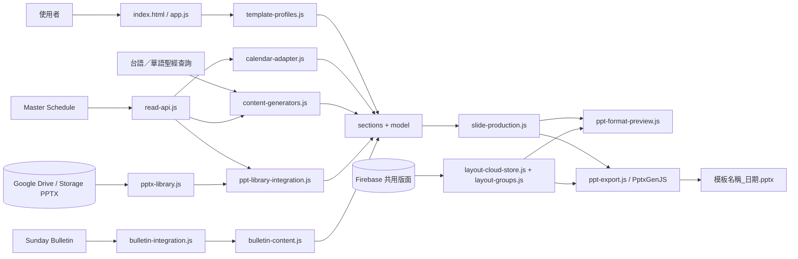
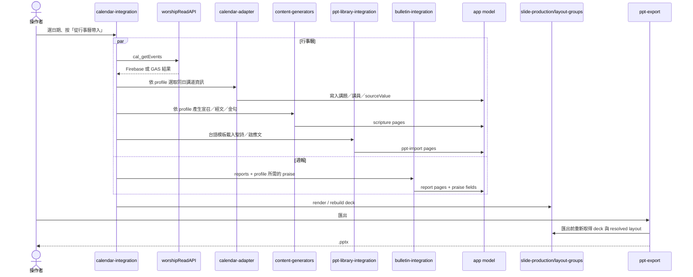

# 禮拜PPT產生器：系統架構與多模板擴充指南

本文件是 `apps/LKC_WorshipPPT/` 的主要技術說明，也是維護「台語」、「聯合－台語」與「聯合－華語」、以及未來開發「華語」PPT 模板時的起點。它說明目前產生器的執行架構、資料來源、模組責任、技術選擇、問題解法、故障回退、驗證方式，以及哪些邏輯屬於共用核心、哪些內容留在模板設定層。

目前程式已實作「台語主日禮拜」、「聯合－台語」與依 `聯合華語模板.ppt` 建立的「聯合－華語」流程。`template-profiles.js` 是三者共用的 declarative 模板設定層；開發其他模板時不要複製整個資料夾，以免 PPTX 解析、分頁、Firebase、版面與匯出修正分岔。

## 1. 系統目標與邊界

系統目標是把散落在行事曆、週報、台語聖經、Google Drive PPTX 資料庫與人工輸入中的禮拜資料，組成一份可預覽、可調整版面、可重複匯出的 16:9 PowerPoint。

目前負責的範圍：

- 依模板與禮拜日期讀取「講道資訊-台語」、「講道資訊-聯合-台語」或「講道資訊-聯合-華語」、報告，以及模板需要的讚美資料。
- 將行事曆欄位轉成講題、講員、經文查詢、聖詩編號及啟應文編號。
- 依模板查詢台語 `tghg`，或依序查詢台語 `tghg` 與華語 `unv` 聖經全文並分頁。
- 從雲端索引配對聖詩／啟應文 PPTX，在瀏覽器解析 OOXML。
- 聖詩與啟應文的預覽可以使用透明 PNG；匯出直接合併原始 PPTX 投影片，保留原生物件與座標，背景依系統設定套用。
- 產生固定禮文、標題頁、讚美歌詞、講道頁、報告頁及其他原生文字頁。
- 提供整份投影片順序預覽、具名版面群組、背景、文字／圖片縮放與樂譜白底透明度設定。
- 匯出真正的 `.pptx`，不是螢幕截圖集合。
- 直接連接既有的行事曆、週報、PPT Library 與聖經唯讀來源；週報優先讀取 Supabase，缺資料或讀取失敗時回退既有 GAS `load`，其他 GAS POST 被 CORS 阻擋或由 `file://` 開啟時提供安全的 JSONP 回退。

目前不負責的範圍：

- 不寫回行事曆、週報、聖經或 Drive 資料庫。
- 牧師講道 PPT 僅接受瀏覽器上傳的 `.pptx`；解析時強制驗證 16:9，通過後轉成 `ppt-import` 頁面接在講道標題頁之後，並可逐頁選擇是否套用禮拜背景。
- 不在瀏覽器端建立或管理 Drive PPTX 資料庫。
- 不在前端保存版面解鎖密碼。
- 不建立行事曆／週報的 Firebase 內容鏡像；前端只讀既有來源 API。Firebase 僅保留版面共用設定用途。

## 2. 一頁式架構總覽



核心原則是「資料先進入統一 model，再轉成 page，再由預覽與匯出共同解析 page 與 layout」。資料來源不直接產生 PowerPoint；預覽也不自行維護另一份排版規則。

## 3. 技術選擇與所解決的問題

| 技術／模式 | 使用位置 | 解決的問題 | 重要限制 |
| --- | --- | --- | --- |
| GitHub Pages + Vanilla JavaScript | 整個 app | 無建置伺服器也能部署；教會工作站直接用瀏覽器操作 | 依賴全域載入順序，新增模組時必須維護 `index.html` |
| IIFE／UMD 風格模組 | `slide-production.js`、`pptx-library.js` 等 | 同一份純函式可在瀏覽器及 Node 測試中使用 | UI 整合檔仍使用全域 `model`、`active`、`render` |
| Firebase Realtime Database | 共用版面設定 | `layout-cloud-store.js` 以共用 bootstrap 載入 SDK | 版面寫入需 Auth；不鏡像行事曆／週報 |
| Firebase Auth Email/Password + in-memory persistence | `layout-cloud-store.js` | 只有知道版面密碼者能改全教會設定；重新整理自動鎖回 | 密碼不得寫入程式或 Git |
| GAS Router／`churchAPI` | 行事曆、PPT 索引、PPT 檔案、聖經 | 沿用既有後端與 Google Workspace 權限 | POST 可能受 `file://`／CORS 影響 |
| JSONP 唯讀回退 | `read-api.js` | 無法 POST 時仍能讀取必要資料 | 只允許明確的唯讀 action；60 秒逾時清理 callback |
| JSZip 3.10.1 | `vendor-jszip.min.js`、PPTX 解析／匯出後處理 | 在瀏覽器解壓縮與重打包 OOXML | PPTX 是 ZIP；大型檔案會消耗記憶體 |
| DOMParser + OOXML | `pptx-library.js` | 不依賴 PowerPoint 桌面程式，直接讀座標、文字、圖片、主題色與裁切 | 目前只解析本系統需要的 shape／picture 子集合 |
| Canvas 2D | 樂譜／啟應文預覽 | 提供網頁中的近似樣貌 | 不作為這些資料庫頁面的輸出來源 |
| OOXML 原生合併 | `native-pptx.js` | 保留來源形狀、文字、座標、群組、母片、版面與圖片 | 來源尺寸須與輸出尺寸相容；字型仍由 PowerPoint 使用本機環境呈現 |
| PptxGenJS 3.12.0 | `ppt-export.js` | 產生可編輯的 PowerPoint 原生文字與圖片物件 | 預覽與 PowerPoint 是兩套文字引擎，必須共用換行與座標規則 |
| CSS container-width 單位 `cqw` | 預覽字級 | 讓 16:9 預覽縮放時維持與 960pt PowerPoint 畫布一致的比例 | 換算固定為 `1pt = 1/9.6cqw` |
| localStorage | 草稿與離線版面備份 | 瀏覽器重開後可恢復內容；雲端故障仍有最後備份 | 不是跨裝置主資料源；資料量受瀏覽器限制 |
| Node `node:test` + 語法檢查 | `*.test.js`、`scripts/verify.ps1` | 在不啟動瀏覽器的情況回歸資料契約、排版算法及來源結構 | 視覺變更仍需桌面 snapshot／瀏覽器 QA |

## 4. 執行階段分層

### 4.1 外殼與互動層

- `index.html`：工作台 DOM、工具列、三欄式版面、Firebase 解鎖對話框及腳本載入順序。
- `app.js`：建立 `sections` 與 `model`，提供基礎 editor、preview、狀態訊息、背景、草稿及匯出按鈕。
- `template-profiles.js`：定義模板下拉選單背後的流程、資料來源、固定頁、母片資產、草稿 key、封面與檔名前綴。
- `template-switch.css`：模板選單、雙欄禮文 editor／preview、聯合華語固定圖片及黑底頁樣式。
- `style.css`：三欄工作區及基本表單。
- `theme.css`：色彩、表面層次、忙碌遮罩、可及性與 reduced-motion。
- `format.css`、`reference-layout.css`：投影片模板的基礎視覺與來源 PPT 對齊。
- `layout-groups.css`：章節導覽、選取狀態、懸浮版面面板及解鎖介面。
- `pptx-library.css`、`sync-opacity.css`、`color-controls.css`：匯入物件、白底透明度與色彩控制。

### 4.2 資料來源與轉接層

- `read-api.js`：連接既有 `churchAPI` 唯讀入口，並在 GitHub Pages／POST 傳輸失敗時使用 JSONP。
- `bulletin-supabase.js`：重用週報系統的 Supabase client、日期查詢及 `reports`／`praise` 欄位映射。
- `calendar-adapter.js`：將 Master Schedule 的 `values[]` 映射到 model，隔離欄位別名與台語事件條件。
- `calendar-integration.js`：協調行事曆、週報、經文與 PPT Library 的整批載入。
- `bulletin-content.js`：正規化報告／讚美資料與報告動態分頁。
- `bulletin-integration.js`：連接 Sunday Bulletin、報告 editor 與 model。
- `source-reminders.js`：在一次帶入完成後檢查行事曆欄位、經文查詢、PPT Library、週報三分類與讚美來源；只要有空白或找不到素材，就以不阻擋操作的警告視窗逐條提醒製作者。

### 4.3 內容產生與來源素材層

- `content-generators.js`：解析經文範圍並呼叫 `cal_queryBible`，產生宣召、聖經與金句頁。
- `ppt-library-integration.js`：取得索引、依編號配對、快取檔案、呼叫 PPTX 解析器並寫回 model。
- `pptx-library.js`：PPTX ZIP／OOXML 解析、座標轉換、主題色、字型繼承、圖片裁切與 Canvas 點陣化。
- `fixed-page-editor.js`：台語使徒信經與主禱文使用單一全文；聯合華語的台語與華語全文各自分頁，維持兩個獨立內文框。
- `production-editor.js`：替經文產生頁與 PPT Library 端口提供專用 editor。

### 4.4 頁面、版面、預覽與匯出層

- `slide-production.js`：純函式核心；頁面組合、固定文字分頁、版面預設、具名群組解析、字級換算及共用換行。
- `ppt-format-preview.js`：把 model 轉成 page kinds，依 kind 產生預覽 DOM。
- `layout-cloud-store.js`：模板版面 schema、Firebase load/save/unlock/lock；台語保留 `shared`，其他模板依 template ID 隔離。與內容 store 共用 Firebase bootstrap，不使用會受 `about:blank` 基準網址影響的相對動態 import。
- `layout-groups.js`：整份 deck、穩定 page ID、章節導覽、勾選群組、即時版面、輸出比例、報告重排與本機／雲端同步。
- `ppt-export.js`：使用與預覽相同的 deck、page kind 與 resolved layout，建立並下載 PPTX。

## 5. `index.html` 腳本載入順序是依賴圖

目前沒有 bundler，腳本順序就是模組初始化順序：

1. `config.js` 建立 `GAS_URL`、`churchAPI`、API readiness 與 action routing。
2. Supabase SDK、`../../supabase/supabase-config.js` 與 `bulletin-supabase.js` 建立週報共用 client 及資料服務。
3. `../../firebase/firebase-config-values.js` 以傳統 script 建立版面共用的 Firebase 設定與 App bootstrap。
4. `read-api.js` 建立既有來源 API 的統一唯讀入口。
5. `vendor-jszip.min.js` 與 PptxGenJS 提供 ZIP、OOXML 與 PPTX 匯出能力。
6. `bible-service.js` 提供經文範圍解析。
7. 純資料模組：`calendar-adapter.js`、`pptx-library.js`、`slide-production.js`、`template-profiles.js`、`bulletin-content.js`。
8. `app.js` 解析 `?template=`，由 profile 建立全域 `sections`、`model`、`editor`、`preview`、`render`。
9. 整合模組依序包裝或替換 editor／preview：內容產生、Library、行事曆、格式預覽、固定頁 editor、production editor、週報 editor。
10. `layout-cloud-store.js` 建立版面雲端介面。
11. `layout-groups.js` 將單章 preview 升級為整份 deck 與共用版面。
12. `ppt-export.js` 最後載入，使用已完成的 deck 與 layout API。

因此，若未來改為 ES modules 或 bundler，必須保留這些依賴關係；不能只按字母排序載入。

## 6. 領域模型與頁面模型

### 6.1 `sections`

`template-profiles.js` 的 `sections` 是各模板流程定義，每筆為：

```js
[sectionId, userFacingLabel, editorType]
```

台語與聯合台語 profile 都有 27 個流程段落；聯合台語沿用台語的聖詩、啟應文、讚美、金句與奉獻流程，但封面改為台華語聯合禮拜，宣召、信仰告白、主禱文、經文與金句改為台華雙語。聯合華語 profile 有 16 個段落，對應來源母片的封面、靜默、序樂、雙語宣召、全心敬拜時刻、雙欄信經、雙語聖經、祈禱、雙欄主禱文、講道、回應詩、報告、奉獻、獻上感恩、祝禱與平安禮。奉獻來源頁已包含標題與說明，因此不再另生一張文字頁。

`sectionId` 是資料映射、Library 載入、版面保存及測試的穩定識別，不應直接用可翻譯的標籤替代。

### 6.2 `model`

每個 section 會建立一筆 model：

```js
{
  label,
  type,
  title,
  kicker,
  body,
  secondaryBody?,
  opacity,
  sourceValue?,
  pptPages?,
  includeSectionTitle?,
  libraryFileId?,
  libraryEntry?,
  libraryError?,
  reportLayout?
}
```

- `title`／`kicker`／`body` 是使用者可理解的內容。
- `sourceValue` 是查詢條件或資料庫索引，不能直接當投影片全文。
- `pptPages` 是已產生或已匯入的 page 清單；存在時優先於 type 的一般規則。
- `secondaryBody` 只用於需要第二個獨立文字來源的聯合華語固定禮文。
- `opacity` 是樂譜頁白色色塊的不透明度，限制 40–80。
- `reportLayout` 保存報告分頁時使用的有效內容框參數。

### 6.3 Page kinds

| kind | 用途 | 預覽／匯出策略 |
| --- | --- | --- |
| `cover` | 禮拜首頁 | 產生禮拜名稱與日期原生文字 |
| `section` | 段落標題頁 | 置中的標題／副標題原生文字 |
| `content` | 一般內容 | 標題＋內文原生文字 |
| `scripture` | 經文 | 標題＋每頁兩節經文；雙語模板保留 `(台)`／`(華)` 標記並依語言順序排列 |
| `liturgical` | 信經／主禱文 | 保留對齊與標題設定的原生文字 |
| `dual-liturgical` | 聯合華語信經／主禱文 | 標題＋左右兩個獨立原生文字框；台語黑字、華語藍字，分別保存座標、字級、行距與對齊 |
| `full-image` | 全心敬拜、奉獻、獻上感恩 | 直接使用專案內的三張 16:9 PNG 原圖；圖片已包含完整文字排版、背景與視覺效果，預覽與匯出不再重建文字 |
| `praise-title` | 讚美標題 | 「讚美」＋歌名／團體，自動垂直置中 |
| `praise-lyrics` | 讚美歌詞 | 只顯示置中內文 |
| `sermon-title` | 講道標題 | 「講道：題目」＋講員／經文，自動垂直置中 |
| `report` | 本會／教界／關懷代禱 | 依實際 layout 動態分頁的原生文字 |
| `score` | 尚未載入的樂譜端口 | 標題與 placeholder；正常流程會被 `ppt-import` 取代 |
| `ppt-import` | Library 來源頁 | `objects` 供預覽；聖詩／啟應文以 `nativeExport` 和 `nativeSource` 指向原始封裝，輸出使用原生投影片 |

`buildDeckEntries()` 將 section pages 攤平成單一 deck，補上 `id`、`sectionId`、`sectionIndex`、`pageIndex` 與連續 `deckNumber`。版面配置依賴穩定 page ID，例如 `hymn-1:section`、`scripture:1`、`announcements:2`。

## 7. 從日期到完整 PPT 的主流程



行事曆與週報並行讀取，縮短等待時間。若找不到模板對應的講道事項，週報仍可成功載入；只有宣告 `librarySections` 的模板才讀取 Library，且逐項回報 missing。

帶入完成後，`source-reminders.js` 會依 profile 的 `sourceRequirements` 彙整一次「資料提醒」警告視窗。它不是錯誤或驗證阻擋：投影片仍會照目前可取得的資料產生。警告會列出模板對應行事曆事件、必要欄位、台語／華語經文、Library 素材、週報分類或讚美資料中尚未建立的項目；聯合華語不要求讚美或 Library 時不會誤報。

## 8. 統一唯讀資料層與回退順序

### 8.1 既有來源 API

WorshipPPT 不複製行事曆與週報內容到 Firebase；資料直接由既有唯讀入口取得：

- 行事曆、PPT Library、聖經：`LKC_MasterSchedule` 的 `churchAPI` action。
- 週報報告與讚美：`SundayBulletinSupabaseService.loadReports/loadPraise` 讀取 Supabase；`bulletin-content.js` 將服務結果交給 PPT model。

### 8.2 週報回退順序

1. `bulletin-supabase.js` 依日期讀取 `sunday_bulletin_reports` 與 `sunday_bulletin_praise`。
2. Supabase 沒有資料、client 不可用或讀取失敗時，回退 Sunday Bulletin GAS `action=load`，沿用 `reports_YYYY-MM-DD` 與 `praise_songs_YYYY-MM-DD` key。
3. 兩個來源都沒有資料時回報 `missing`，不阻止其他投影片產生。

### 8.3 `read-api.js` 回退順序

1. GitHub Pages／`file://` 的四個唯讀 action 優先使用 JSONP，避開 GAS POST 重導到 `script.googleusercontent.com` 時偶發的 404。
2. 其他 HTTP(S) 頁面等待 `config.js` API ready，再呼叫 `churchAPI(action, data)`。
3. POST 遇到 network、4xx/5xx 或非 JSON 回應時改用 JSONP。
4. JSONP 建立唯一 callback，60 秒逾時或 script error 時移除 callback 與 script。

JSONP 只應開放：

- `cal_getEvents`
- `cal_getPptLibraryIndex`
- `cal_getPptLibraryFile`
- `cal_queryBible`

這些都是唯讀 action。新增模板不可利用這條回退路徑執行寫入。

## 9. 行事曆欄位契約

`calendar-adapter.js` 負責把後端資料格式隔離在 model 之外。

### 9.1 事件選取

- 日期必須等於所選禮拜日期。
- `typeName` 與 `typeFullName` 必須同時符合 active profile 的 `calendarSelector`；目前分別支援台語與聯合華語。
- 找不到時回傳 `null`，不退回同日第一筆事項，避免帶錯語言或錯場次。

### 9.2 欄位別名

- 講題：`講題`、`講道題目`、`講道`
- 講員：`講員`、`講道者`
- 經文：`經文`、`講道經文`
- 宣召：`宣召`
- 金句：`金句`
- 啟應文：`啟應文`、`啟應`
- 聖詩一：`聖詩第一首`、`聖詩一`、`聖詩1`
- 聖詩二：`聖詩第二首`、`聖詩二`、`聖2`
- 頌榮：`頌榮`

聖詩編號正規化保留英文字尾，例如 `306B`，因為 Drive 檔名與來源素材可能以字尾區分版本。聖詩一／二同時供應會前與正式禮拜對應段落，以同一 file ID 共用解析快取。

## 10. 經文內容產生

`content-generators.js` 不直接解析任意文字；它使用共用 `LKC_ppt_generator/bible-service.js` 的 `parseQuery()` 將行事曆值拆成一個或多個標準查詢，再呼叫：

```js
cal_queryBible({ book, chap, sec, version })
```

結果統一成 `bible_text`，並為每筆經節保留 `queryBookName`、`queryChap`、`querySec` 與 `queryGroupKey`，再交給 `buildBiblePages()` 每頁兩節。不同 `queryGroupKey` 絕不放在同一頁；標題優先使用原始查詢段落的 `querySec`，所以同卷多段如 `創世記 1:1-10; 2:1-5` 會拆為各自的 `聖經－創世記 1:1-10` 與 `聖經－創世記 2:1-5`，不隨每一張內文頁的兩節切分而改變。沒有查詢段落資料時才以該頁第一節與最後一節重建範圍。台語模板使用 `tghg`；聯合台語的宣召、經文與金句，以及聯合華語的宣召與經文，皆依序使用 `tghg`、`unv` 並保留語言標記。台語與聯合台語的金句在經文頁前額外插入 `verse:title` 標題頁；兩個台語模板的會前聖詩一、會前聖詩二、聖詩一、聖詩二與頌榮，皆在匯入聖詩內容前插入獨立標題頁。

這個設計解決兩個問題：

- `sourceValue` 可以保留原始經文範圍供人檢查，不會與產生後全文混在一起。
- `file://` 不必直接呼叫外部聖經 API；GAS／Firebase 仍是統一資料邊界。

版本、段落與語言標記均由 profile 提供，不在 generator 內寫死。

## 11. 聖詩／啟應文 PPTX 資料庫

### 11.1 索引與檔名契約

- 聖詩：`第{編號}{可選字尾}首 {名稱}.pptx`。
- 啟應文：`{編號}.pptx`。
- 固定素材：祈禱詩 `261`、奉獻 `306B`、阿們頌 `522`。
- 只有奉獻 `306B` 預設保留段落標題頁；`261` 與 `522` 直接進入素材頁。

`ppt-library-integration.js` 對索引使用單一 `indexPromise`，對檔案使用以 `fileId` 為 key 的 `Map`。失敗時刪除 cache entry，使下次可以重試，不會永久快取 rejection。

聯合華語的三張固定成品頁不走 PPT Library 或 GAS。來源資料夾中的 `全心敬拜時刻.png`、`華語奉獻.PNG`、`獻上感恩.PNG` 已納入 `templates/`，由 profile 的 `assets` 與 `assetKey` 直接對應 `worship-moment`、`offering`、`thanksgiving`。奉獻原圖已包含標題與說明，因此不另生奉獻標題頁或文字頁。

### 11.2 下載策略

1. `downloadUrl`／`storageUrl` 是 Firebase Storage 或 Google Cloud Storage URL：瀏覽器直接下載 binary。
2. 聯合華語三張固定成品頁直接載入同站 `templates/` PNG，不呼叫 GAS。
3. 只有沒有 read API 時才嘗試 Drive usercontent URL。

Drive URL不直接優先 fetch，因為 GitHub Pages 瀏覽器常受 CORS 或確認頁阻擋。

### 11.3 OOXML 解析

PPTX 本質是 ZIP。`pptx-library.js` 使用 JSZip 與 DOMParser：

1. 讀 `ppt/presentation.xml` 取得投影片 EMU 尺寸。
2. 讀 theme 與 slide master，建立 `schemeClr` 色彩映射。
3. 依數字排序 `ppt/slides/slideN.xml`。
4. 解析每張 slide relationship，找出圖片、layout 與其他 parts。
5. 遞迴走訪 `spTree`，處理群組 transform。
6. 將 EMU 座標轉成相對百分比，避免來源尺寸差異。
7. 解析文字 runs 的字級、粗斜體、底線、字型、顏色、水平／垂直對齊。
8. 當 run 沒有字級時，從 slide layout placeholder 的 `lvl1pPr/defRPr` 繼承。
9. 解析圖片 relationship 與 `<a:srcRect>` 裁切。

### 11.4 預覽與原生匯出分離

Canvas 並非 PowerPoint 的文字排版引擎，依座標重畫也無法保證原檔呈現。所有 `kind: hymn` 與 `kind: response` 資料庫來源保留原始 ZIP；Canvas 僅產生近似預覽。此規則涵蓋會前聖詩、聖詩一／二、祈禱詩、奉獻詩、頌榮、阿們頌及啟應文，台語與聯合台語共用。

- 頁碼順序由 `presentation.xml` 的 `sldIdLst` 決定，而非 slide 檔名的數字順序。
- 匯出前 `ensureNativeLibrarySources()` 補載來源。舊草稿不能將點陣圖片當成原檔；來源缺失時停止輸出。預覽繪製失敗不阻止有效原檔輸出。
- PptxGenJS 為來源頁建立只含背景及既有白色遮罩的佔位頁。`native-pptx.js` 用原始 slide XML 取代內容，再把佔位頁背景及遮罩放在來源物件下方。
- 原始物件 XML 不經座標、字級、行距、群組版面或全域文字／圖片縮放改寫；啟應文標題也保留原始設定。
- 母片、版面、主題、媒體等依 relationship 複製並重接路徑。母片與版面使用不衝突的數字 ID；每個插入頁有獨立備忘稿及正確的 slide 反向關聯，支援同一聖詩重複出現。
- 來源不透明物件仍維持不透明，原檔中的圖像不做去背；系統背景與白色遮罩規則維持原設定。
- 一般首頁、標題、經文、禮文、報告、讚美與講道頁保持 PowerPoint 原生文字。

驗收使用 `native-pptx.browser.test.cjs` 在瀏覽器中完成真實 ZIP 匯出，檢查原始物件 XML、頁序、背景／遮罩、母片 ID 唯一性、備忘稿反向關聯及所有內部關聯。`ppt-library-integration.test.js` 檢查兩個台語模板的所有資料庫段落、舊草稿補載、預覽失敗及原檔缺失。測試檔另以本機 PowerPoint 開啟、比對物件座標並渲染檢查。

### 11.5 `srcRect` 正負裁切

來源 PPT 可能使用：

- 正裁切：只取原圖中間區域。
- 負裁切：來源影像虛擬延伸到圖片外，產生留白。
- 正負混合：例如一側裁切、一側延伸。

`calculateCroppedImageDraw()` 同時計算來源矩形與目的矩形：

- 先建立可超出 0–1 的 virtual crop rectangle。
- 將真正可讀的來源範圍 clamp 到 0–1。
- 按 virtual rectangle 比例把有效來源映射回目的框。
- 負裁切超出原圖的區域保留透明，不可歸零後拉伸整張圖。
- 無有效寬高或完全落在來源外時回傳 `null`，安全略過。

這個算法處理了 123B、515 等來源檔的跑版問題，未來所有模板都應共用，不能為單一聖詩寫檔名特例。

## 12. 週報、讚美與報告動態分頁

### 12.1 資料來源

週報系統的 Supabase 資料表與 PPT model 對應如下：

| 週報服務 | Supabase table／欄位 | PPT model 欄位 |
| --- | --- | --- |
| `loadReports(date)` | `sunday_bulletin_reports.date`、`announcements`、`church_news`、`prayer` | `model.announcements.announcements`、`churchNews`、`prayer` |
| `loadPraise(date)` | `sunday_bulletin_praise.date`、`title`、`kicker`、`lyrics` | `model.praise.title`、`kicker`、`body` |

`sunday_bulletins` 是週報主檔／草稿的完整資料表；PPT 報告與讚美目前使用上面兩張專用表，因為 `reports.html` 與 `praise.html` 就是寫入這兩張表。GAS 回退仍使用日期 key：

- `reports_YYYY-MM-DD`
- `praise_songs_YYYY-MM-DD`

GAS 歷史資料回填使用 `scripts/sync_sunday_bulletin_gas_to_supabase.js`。工具先以 `action=list` 取得 key，再逐筆 `action=load`；預設為 dry-run，加入 `--write` 才會對三張表執行以 `date` 為衝突鍵的 upsert。它只處理 `bulletin_draft_`、`reports_`、`praise_songs_` 三種 key，不執行刪除，並保留來源的 `updatedAt`。

報告資料正規化成：

```js
{
  announcements: [],
  churchNews: [],
  prayer: { homeRest, hospital, other }
}
```

產生順序固定為「本會消息 → 教界消息 → 關懷代禱」。三類資料都有自己的報告標題，整章之前另保留「報告」section page。讚美資料寫入歌名、演唱團體與歌詞；歌詞以空白行分頁。

### 12.2 為什麼不能固定每頁兩點或固定五行

同一則報告在不同字級、內容框寬度、框高度、行距與輸出比例下會占不同高度。固定兩點會讓長項目溢出，固定五行又會在字體縮小後浪費空間。

目前行容量公式：

```text
fontHeightPx = contentSize(pt) × textScale × 4/3
availableHeightPx = 720 × contentH / 100
lineCapacity = floor(availableHeightPx / (fontHeightPx × lineSpacing))
```

寬度則交給 `wrapTextForBox()`，以 1280px 寬預覽基準、內容框百分比、實際字級及 0.92 safety factor 估算換行，並避免中文標點出現在行首。

### 12.3 分頁規則

- 項目間空一行，空行也計入容量。
- 項目能完整放入目前頁才加入，否則先換頁。
- 單項超過一頁才產生 `3.（續）` 之類的續頁。
- 一般續頁把標記放在獨立一行。
- 若內容框實際只能容納一行，改成 `3.（續）內容…` 同行分段，避免標記本身造成第二行溢出。
- 估算用的軟換行不寫回 `body`；只保留來源硬換行、項目分隔與必要續頁標記。
- page 會記錄 `estimatedLines` 與 `lineCapacity` 供測試驗證。

報告會在以下時機重新分頁：資料載入、手動修改、版面欄位變動、具名版面儲存、雲端版面載入、文字輸出比例變動，以及匯出前。

## 13. 固定禮文與一般文字分頁

台語使徒信經與主禱文在 model 中保留單一全文，避免使用者逐頁維護。`fixed-page-editor.js` 取來源三頁的文字量作為權重，`paginateFixedText()` 以空白行為優先切點，把修改後全文重排回原頁數與每頁模板屬性。

聯合台語與聯合華語共用同一組雙語禮文版型：信經五頁、主禱文四頁。每頁都是 `dual-liturgical`：`primaryBody` 與 `secondaryBody` 分別對應左右文字框，並各自使用來源頁的文字量權重重排；絕不把兩種語言串入單一文字框。每頁 `layout` 保存從母片換算的左右框座標、字級、顏色與行距。

## 14. 預覽與匯出的單一版面來源

### 14.1 Layout 參數

```js
{
  titleSize, titleX, titleY, titleW, titleH, titleAlign, titleColor,
  contentSize, contentX, contentY, contentW, contentH, contentAlign,
  contentColor, lineSpacing,
  secondaryContentSize?, secondaryContentX?, secondaryContentY?,
  secondaryContentW?, secondaryContentH?, secondaryContentAlign?,
  secondaryContentColor?, secondaryLineSpacing?
}
```

座標與寬高都是投影片百分比；字級是 PowerPoint point。

### 14.2 合併優先順序

`resolvedLayoutForPage()` 的順序是：

```text
page kind 預設值
  < page.layout 個別值
  < 具名 layout group
```

後者覆蓋前者。預覽與匯出都必須呼叫這個函式，不能各自另寫 default。

特殊預設包括：

- `cover`、一般 `section`、有副標題的聖詩標題頁。
- `praise-title`／`sermon-title` 依實際行數垂直置中整組文字。
- `praise-lyrics` 使用較大的置中內容框。
- `report` 以最近一次重排用的 `reportLayout` 作為新頁預設。
- `dual-liturgical` 同時解析台語與華語兩組內容框參數。
- `ppt-import` 無一般文字預設，保留來源物件座標。

### 14.3 字級與畫布換算

PowerPoint 寬螢幕寬度是 13.333 吋，也就是 960pt。預覽以容器寬度為基準：

```text
pointsToCanvasCqw(pt) = pt / 9.6
canvasCqwToPoints(cqw) = cqw × 9.6
```

因此 60pt 對應 6.25cqw、48pt 對應 5cqw。版面面板從 DOM 反向量測時也使用同一換算。

### 14.4 共同換行

瀏覽器與 PptxGenJS 的字寬計算不同。`wrapTextForBox()` 使用 Canvas `measureText()` 產生一致的換行決策；Node 測試沒有 Canvas 時使用中文／ASCII／空白／標點的權重 fallback。0.92 safety factor 為 PowerPoint 的內部文字引擎保留安全空間。

報告只用這些 line segments 決定分頁，不永久保存軟換行；其他原生文字頁匯出前可使用同一函式產生明確換行。

## 15. 版面群組、導覽與共用設定

`layout-groups.js` 把所有 sections 攤平成一份連續 deck，左側以章節／頁面方式呈現：

- 點頁面列只切換預覽。
- 勾選頁面加入版面編輯範圍。
- 勾選章節會批次選取該章所有頁面。
- 具名群組保存一批 page IDs 與同一組 params。
- 頁面重新加入另一群組時，會先從舊群組解除。
- 解除群組只移除 assignment，不刪除其他頁面使用的群組。
- 方向鍵可跨章依整份 deck 瀏覽；輸入欄位內仍保留游標操作。

懸浮面板從目前畫布的 computed layout 反向量測，不以固定表單值猜測。面板可拖曳，標題與內文分頁調整，顏色分開保存。

全份共用設定另包含：

- `outputScale.text`：80–120%。
- `outputScale.image`：80–120%。
- `hymnOpacityBySection`：各樂譜段落 40–80%。
- 「聖詩頁白底透明度同步」決定調整一段時是否同步所有樂譜段落。

白色色塊只套用 `ppt-import`／`score`，不套聖詩 section title，避免標題頁被洗白。

## 16. Firebase 共用版面、權限與離線一致性

模板版面位於：

```text
worshipPpt/layoutConfig/shared
worshipPpt/layoutConfig/templates/{templateId}
```

台語沿用 `shared`；聯合台語與聯合華語分別使用 `templates/joint-taiwanese`、`templates/joint-mandarin`。聯合台語在自己的雲端版面尚不存在時，先讀取台語 `shared` 作為初始 clone，但會排除 `creed:*` 與 `lord-prayer:*` 的台語 page assignments，使這兩段直接使用聯合華語來源的雙欄模板參數；第一次解鎖保存後只寫入自己的 namespace。各模板也使用不同 localStorage 草稿 key，避免內容與 page assignments 互相覆蓋。

文件 schema：

```js
{
  schemaVersion: 1,
  layoutState: {
    groups,
    pageAssignments,
    hymnOpacityBySection?,
    outputScale?
  },
  updatedAt,
  updatedBy
}
```

讀取公開、寫入受 Firebase Rules 與固定 Auth email `worship-layout@lkc1958.org` 保護。登入使用 `inMemoryPersistence`，重新整理即失效。

本機與雲端衝突規則：

1. 若 `layoutSyncPending === true`，保留尚未成功上傳的本機版面，不以舊雲端覆蓋。
2. 無 pending 且雲端存在，使用雲端。
3. 雲端不存在或讀取失敗，使用 localStorage 備份。
4. 保存前先把 pending 寫入 localStorage；雲端成功後才清除 pending。

這個順序避免「畫面說已保存，但重新整理後被舊雲端設定覆蓋」。背景圖片與每週內容不寫入共用 layout 節點。

## 17. PPTX 匯出管線

`ppt-export.js` 在匯出前先重新計算報告頁，再取得最新 deck。每張投影片依相同順序建立：

1. 全份共用純色或背景圖。
2. 樂譜頁才加白色色塊。
3. 解析 `resolvedLayoutForPage()`。
4. 依 page kind 加入圖片或原生文字。

輸出尺寸固定 `LAYOUT_WIDE`／`13.333 × 7.5`。座標換算：

```text
x or width = percent / 100 × 13.333
y or height = percent / 100 × 7.5
```

原生文字統一：

- Microsoft JhengHei。
- 粗體。
- margin 0。
- title 與 content 都頂端錨定，與瀏覽器一致。
- 行距按 `fontSize × lineSpacing` 計算。
- 文字與圖片輸出比例以中心為基準縮放。

舊的非原生匯入路徑仍可依 title／content role 映射版面。標記 `nativeExport` 的聖詩／啟應文輸出不經此路徑，直接保留來源物件；版面群組及全域文字／圖片縮放不會改動其原檔座標。

PptxGenJS 產生 blob 後，若 JSZip 可用，系統會再次打開輸出 PPTX，清理同一 `<a:p>` 中重複的 `<a:pPr>`，再重打包下載，避免 PowerPoint XML 中出現多個 paragraph properties。

檔名由 profile 的 `filenamePrefix` 產生，目前為：

```text
台語主日禮拜_YYYY-MM-DD.pptx
聯合-華語禮拜_YYYY-MM-DD.pptx
```

## 18. 背景、視覺與可及性

- 背景可使用安全的 PNG／JPG／WebP Data URL 或純色。
- 台語、聯合台語與聯合華語模板皆以純白色 `#ffffff` 為預設背景；只有使用者自行上傳背景圖時才套用全份背景圖片。
- 背景圖不包含固定教會名稱或頁首，讓模板內容與視覺分離。
- 三欄工作台固定為流程、編輯器、16:9 預覽。
- 狀態區使用 `role=status`、`aria-live=polite`。
- 忙碌狀態顯示全畫面半透明遮罩並阻擋操作。
- 動畫遵守 `prefers-reduced-motion`。
- 版面解鎖對話框使用 password input，不回顯密碼。

目前使用情境以桌面製作為主；行動版不是此階段驗收目標。若未來要支援手機，必須另做 mobile snapshot 與操作密度設計，不應只縮小桌面三欄。

## 19. 快取、重試與失敗模式

| 情況 | 行為 |
| --- | --- |
| 來源 API 回傳 404／非 JSON | 回退 GAS／JSONP 或顯示來源錯誤 |
| 週報 Supabase 讀取失敗或沒有資料 | 回退 Sunday Bulletin GAS `action=load`；兩者皆無資料才顯示來源提醒 |
| 版面 Firebase SDK 載入失敗 | 清除 promise，下一次可重試 |
| GAS POST network/CORS 失敗 | 回退 JSONP |
| JSONP 逾時／載入失敗 | 清理 script/callback，回報可讀訊息 |
| PPT Library 索引失敗 | 清除 `indexPromise`，下一次可重試 |
| 單一 PPTX 解析失敗 | 清除該 file ID cache，不污染其他素材 |
| Library 找不到編號 | 清除該 section pages，保存 `libraryError` |
| 無效圖片 crop | 略過該圖片，不讓整份簡報中斷 |
| 雲端版面讀取失敗 | 使用 localStorage 備份 |
| 雲端版面寫入失敗 | 保留 `layoutSyncPending` 並顯示失敗，不宣稱成功 |
| 報告框只能容納一行 | 續頁標記與內容同行，避免垂直溢出 |
| 匯出前 deck 為空 | 直接丟出「沒有可匯出的投影片」 |

## 20. 測試與完成條件

執行：

```powershell
.\scripts\verify.ps1
```

腳本會：

1. 對 app 內所有非 vendor JavaScript 執行 `node --check`。
2. 依檔名執行所有 `*.test.js`。
3. 驗證 Firebase worship layout rule 範本存在必要節點。

主要測試面：

- 行事曆欄位別名、日期／語言嚴格選取及英文字尾聖詩編號。
- Firebase action path 與 fallback。
- 固定禮文、經文、deck、layout group 及 preview/export 共用版面。
- 報告三分類、動態容量、字級／寬高／行距／輸出比例及單行框續頁。
- PPTX 檔名配對、群組 transform、EMU 百分比、主題色、placeholder 字級。
- 正裁切、負裁切、混合裁切與無效 crop。
- PptxGenJS 物件、背景、白底、標題錨定、輸出比例及 XML 清理。
- Firebase Auth lock、pending local layout、cloud load/save。
- 來源提醒會逐條區分「當日資料尚未建立」、「欄位空白」、「經文查無內容」與「Library 素材找不到」。
- UI 三欄、色彩、busy overlay 與產品命名。

文件或純資料契約變更至少跑完整 verify；排版、CSS、Canvas 或互動變更還要做桌面瀏覽器 visual QA。只有測試通過不能取代畫面檢查。

## 21. 四種模板的擴充邊界

目標模板：

1. 台語。
2. 聯合－台語。
3. 聯合－華語。
4. 華語。

### 21.1 應共用的核心

下列邏輯不應複製：

- 既有來源 API／GAS／JSONP 唯讀資料層。
- Firebase 共用版面 store、Auth lock、pending/offline 規則。
- PPTX 索引、下載、JSZip／OOXML 解析、Canvas 點陣化與 crop 算法。
- PptxGenJS 匯出器與輸出後 XML 清理。
- deck/page ID、layout group、背景、輸出比例、樂譜白底。
- 16:9 座標、pt/cqw 換算、共同換行。
- 報告動態分頁引擎。
- 固定全文按權重分頁的工具。
- Node tests 與 visual QA 流程。

目前已啟用 `taiwanese`、`joint-taiwanese` 與 `joint-mandarin`；`mandarin` 是保留的下一階段 template ID。

### 21.2 必須由模板設定提供的差異

| 差異 | 台語 | 其他模板提供 |
| --- | --- | --- |
| template ID | `taiwanese` | `joint-taiwanese`、`joint-mandarin` 已實作；`mandarin` 保留 |
| 顯示名稱 | 台語主日禮拜 | 聯合／華語對應名稱 |
| 流程 sections | 27 段固定陣列 | 每模板自己的順序、label、type |
| 行事曆事件條件 | `講道資訊-台語` | typeName/typeFullName selector |
| 欄位 aliases | 台語現行欄位 | 模板自己的欄位或共用 aliases |
| 聖經版本 | `tghg` | 華語版本代號與顯示格式 |
| 固定禮文 | 台語信經／主禱文 | 聯合或華語全文、頁模板與權重 |
| 固定素材 | 261、306B、522 | 模板對應 Library references |
| Library kind | hymn／response | 可重用，必要時增加語言／collection 維度 |
| cover 文案 | 台語主日禮拜 | 模板名稱與日期格式 |
| section subtitles | 台語文案 | 模板自己的提示文案 |
| 預設 layout | 現行台語來源 PPT | 各模板的版型 defaults／layout profile |
| Firebase layout path | `layoutConfig/shared` | `layoutConfig/templates/{templateId}` |
| 匯出檔名 | 台語主日禮拜_日期 | 由模板提供 filename prefix |

### 21.3 現行 template profile

現行程式以單一 declarative profile 契約提供模板差異，避免在各模組散落 `if (language === ...)`：

```js
{
  id: 'taiwanese',
  label: '台語主日禮拜',
  filenamePrefix: '台語主日禮拜',
  calendarSelector: {
    typeName: '台語',
    typeFullName: '講道資訊 - 台語'
  },
  bibleVersions: ['tghg'],
  sections: [...],
  fieldAliases: {...},
  fixedTexts: {
    creed: { body, pageTemplates },
    lordPrayer: { body, pageTemplates }
  },
  fixedLibrary: {
    prayerSong: '261',
    offering: '306B',
    amen: '522'
  },
  sectionSubtitles: {...},
  layoutDefaults: {...}
}
```

實際欄位以 `template-profiles.js` 為準。聯合華語另外提供 `assets`、`sourceRequirements`、兩組固定禮文全文與每頁 `dual-liturgical` 版面。

### 21.4 Layout namespace

目前台語相容路徑與模板隔離路徑為：

```text
worshipPpt/layoutConfig/shared
worshipPpt/layoutConfig/templates/{templateId}
```

`layout-cloud-store.js` 已依 template ID 選路徑，Firebase Rules 也允許安全格式的 `$templateId`。若有真正跨模板共用的輸出比例或背景，可以另設 global defaults，但模板版面與 page assignments 必須繼續隔離。

### 21.5 內容 namespace

目前：

```text
worshipPpt/content/services/{date}/calendar
worshipPpt/content/services/{date}/reports
worshipPpt/content/services/{date}/praise
```

聯合／華語若同日有不同講道事項或不同讚美／報告內容，建議明確引入 template/service key，例如：

```text
worshipPpt/content/services/{date}/{templateId}/calendar
worshipPpt/content/services/{date}/{templateId}/reports
worshipPpt/content/services/{date}/{templateId}/praise
```

若週報資料實際是跨語言共用，就由同步端讓多個 template 指向同一來源，不要靠前端猜測「聯合」應讀哪一筆。

### 21.6 建議實作順序

1. 以現有 `template-profiles.js` 新增 profile 與選單 option。
2. 提供流程、行事曆 selector、Bible versions、固定禮文／素材、來源需求與檔名前綴。
3. 需要雙欄禮文時建立 `dual-liturgical` pages，不把兩種語言合成一個 `body`。
4. 以 `layoutConfig/templates/{templateId}` 隔離新版面，並同步 Rules。
5. 完整比對既有模板改造前後的 deck 順序、頁數、畫面與匯出。
6. 對每個模板建立代表日期 fixture、視覺基準與匯出 smoke test。

### 21.7 新模板驗收清單

- 是否選到正確日期、正確語言／聯合場次的行事曆事項？
- 欄位 aliases 是否能取得講題、講員、經文、聖詩、啟應文與頌榮？
- Bible version 與固定禮文是否符合模板語言？
- sections 順序、標題頁有無與來源 PPT 一致？
- 固定 Library 編號與是否需要 section title 是否正確？
- 同一來源 PPTX 是否仍通過 crop、主題色、字型繼承與透明背景測試？
- 報告是否使用模板實際字級、框寬高與行距重排？
- layout、content 與草稿是否與其他模板隔離？
- 預覽、匯出、檔名與頁數是否一致？
- 桌面 visual QA 與完整 verify 是否通過？

## 22. 開發守則與常見錯誤

- 不要在 preview 與 export 各修一次座標；修 `slide-production.js` 的 shared layout。
- 不要為特定聖詩檔名寫裁切特例；修通用 OOXML／crop 算法並加 fixture test。
- 不要把行事曆 `sourceValue` 當成投影片正文。
- 不要把大型 PPTX Base64 存入 RTDB；用 Storage 或即時 GAS proxy。
- 不要讓 Firebase 讀取失敗阻止 GAS fallback。
- 不要在雲端保存成功前清除 local pending。
- 不要用每頁固定項目數處理報告。
- 不要把估算用的軟換行永久寫入報告來源文字。
- 不要讓多模板共用同一組未 namespace 的 page assignments。
- 不要複製整個 app 建四份解析器與匯出器。
- 調整腳本載入順序時要確認被包裝的 `editor`／`preview` 已先存在。
- 修改外部 action、Firebase path、page IDs 或跨系統資料流時，同步更新本文件與 `docs/SYSTEM_RELATION_GRAPH.md`。

## 23. 相關文件

- 全系統關聯圖：`docs/SYSTEM_RELATION_GRAPH.md`
- Firebase 內容同步契約：`firebase/WORSHIP_PPT_CONTENT_SYNC.md`
- Firebase 共用版面設定：`firebase/WORSHIP_LAYOUT_SETUP.md`
- Firebase RTDB 規則範本：`firebase/database.rules.worship-layout.json`
- Firebase Storage 規則範本：`firebase/storage.rules.worship-ppt`
- 完整驗證入口：`scripts/verify.ps1`
