# LKC1958 整體系統關聯圖

## GAS ↔ Supabase 年度同步稽核與 GAS 帳本（2026-09）

~~~mermaid
flowchart LR
    Schedule["GitHub Actions<br/>reconcile-gas-supabase.yml<br/>每日 03:15 台灣時間"] --> Auditor["Node 稽核執行器<br/>scripts/reconcile-gas-supabase.js"]
    Auditor --> MainGAS["主日出席／小組 GAS<br/>只讀 action"]
    Auditor --> NewFamilyGAS["新家人 GAS<br/>只讀 tracking / closed"]
    Auditor --> BulletinGAS["週報 GAS<br/>list / load"]
    Auditor --> Supabase["Supabase<br/>只讀查詢"]
    Auditor --> LedgerAPI["Sync Controller GAS<br/>sync_controller_gas"]
    LedgerAPI --> LedgerSheets["Google Sheets<br/>SYNC_RUNS / SYNC_ITEMS<br/>SYNC_EVENTS / SYNC_REPAIR_QUEUE"]
~~~

- 稽核範圍預設為最近 365 個含首尾日期；會友名單與小組現況為全量快照，主日出席、新家人、週報與小組點名依日期窗查詢。
- church_members、attendance_records、new_family_cases、groups、group_members、group_attendance_records、sunday_bulletins 與 sunday_bulletin_reports 依穩定識別鍵比對 MATCHED、單側存在、內容差異與識別錯誤。
- 讚美詩只比對 GAS 的歌名集合與 Supabase sunday_bulletin_praise_titles 索引；歌詞與日期歌單不納入雙邊內容一致性判定。
- Supabase 與 GAS 任一來源無法讀取時，稽核結果記為 SOURCE_UNAVAILABLE，不得推論另一側資料已刪除。
- 稽核器只寫入 GAS 帳本，不寫入 Supabase 或業務 GAS；SYNC_REPAIR_QUEUE 只保存待人工覆核的方向與差異摘要，目前沒有自動修復／刪除執行器。
- sync_controller_gas 的試算表是稽核紀錄的持久化位置，避免 Supabase 故障時連同步證據也遺失。正式啟用前在該 GAS 執行 bootstrapSyncLedger() 建立專用試算表、Script Properties 與欄位。

## 個人卡片分享流程（2026-07）

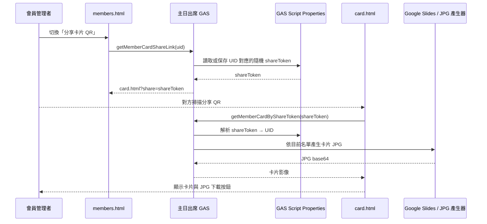

- 分享 QR 與原本卡片內的 UID 點名 QR 分離；前者只開啟卡片分享頁，後者仍交由點名掃描器處理。
- 公開頁只接受已簽發的隨機分享碼，不接受 UID／姓名查詢；分享碼對應目前名單，會友不存在時連結失效。
- 卡片產生仍由主日出席 GAS 的 `MemberDB.js` 呼叫 Google Slides 暫存模板，GitHub Pages 不持有 Google 憑證。

## 會員大會 QR 點名資料流（2026-08）

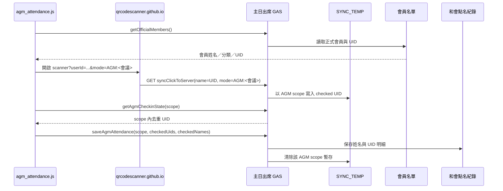

會員大會與主日點名共用 QR Scanner 及 `syncClickToServer`，但以 `AGM:<會議名稱>` 作為 `SYNC_TEMP` 的獨立類別 scope；因此不會把會員大會掃描結果混入台語、華語或聯合點名。會員大會提交資料的正式來源仍是 `會員名單`，UID 是跨裝置同步與存檔的穩定鍵。

## 管理入口快取維護流程（2026-07）

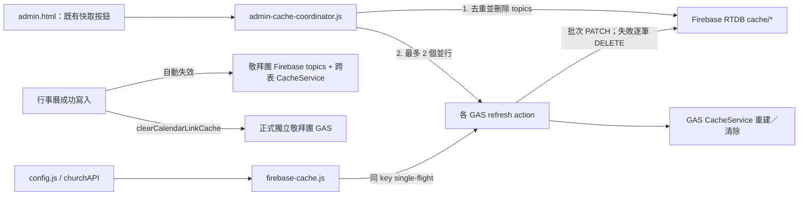

- 使用者操作契約不變：入口、按鈕、確認視窗、成功／失敗提示與 action 名稱維持原樣。
- 單一與全量維護都採「刪除舊 Firebase topic → 呼叫 GAS refresh」，避免 warm cache 被後續刪除。
- `firebase/cache-single-flight.mjs` 只合併同一瀏覽器頁面中相同 topic/subkey 的進行中請求；完成或失敗後立即釋放。
- GAS `firebaseInvalidate(topics)` 使用一次 RTDB root PATCH 清除多個 topic；非 2xx 或例外時保留逐筆刪除 fallback。
- 行事曆成功寫入會由主 GAS 直接對 Firebase `cache` 根節點批次失效敬拜團相依快取：正式/合併版讀取 topic、合併版跨表快取，以及正式獨立敬拜團 GAS 的跨表快取；Router 僅保留維運救援用途。
- 事工管理的 `pageFieldConfig` 是前端班表與主 GAS 的設定契約；`scheduleTarget=clusters` 與欄位 `useMemberList` 必須由 GAS 正規化後原樣保存，才能讓小組群清單在重載後繼續提供給班表欄位。
- `LKC_MinistrySchedule/script.js` 讀取 `pageFieldConfig` 時，以 GAS 已儲存欄位設定覆蓋同名 localStorage 欄位；只保留本機獨有暫存欄位，避免瀏覽器舊快取阻斷新的小組群 datalist。
- 新家人服事模板同時輸出角色專用 datalist 與完整 `customMembersList`；班表中任何 `useMemberList=true` 的自訂欄位，皆可取得已儲存的同工或小組群名單。
- 新家人前端執行「加入會友名單」時，直接呼叫合併主 GAS 的 `addMember`；基於個資最小化，跨系統欄位契約僅允許新家人追蹤資料 `姓名` → `name`、`性別` → `gender`，不得傳送備註或其他欄位；成功後再提交 `saveAttendance`。
- 新家人表單的 `會友狀態` 採正向標記：只有姓名比對到既有主日會友時才寫入「已加入」；未比對到會友時保持空白，不寫入「未加入」。
- 聚會型模板由主 GAS 同時提供 `members`（核心＋一般）、`coreMembers`（核心＋陪伴）與 `generalMembers`（一般同工）。班表欄位是否綁定 datalist 只依 `pageFieldConfig.fields[].useMemberList`；啟用時前端使用 `generalMembers`，停用時不綁定，不能再依欄位名稱推斷角色清單。`members`／`coreMembers` 保留給 AI 排班與角色權限資料流。
- 事工頁面的正式索引位於事工管理 Google Sheet 的 `Config` 工作表；Firebase `ministry_getPageConfig` 只是成功讀取結果的快取，不參與分頁身分判定或鎖定。
- `ministry_createGroup` 與 `ministry_autoSyncSmallGroups` 必須在合併主 GAS 內共用 ScriptLock。鎖內重新讀 Config，依小組 UUID、正規化 ID、名稱比對並修復缺少的 Config／工作表，避免多手機或定時同步重複建立同名 Sheet。

### 事工分頁並行建立／修復

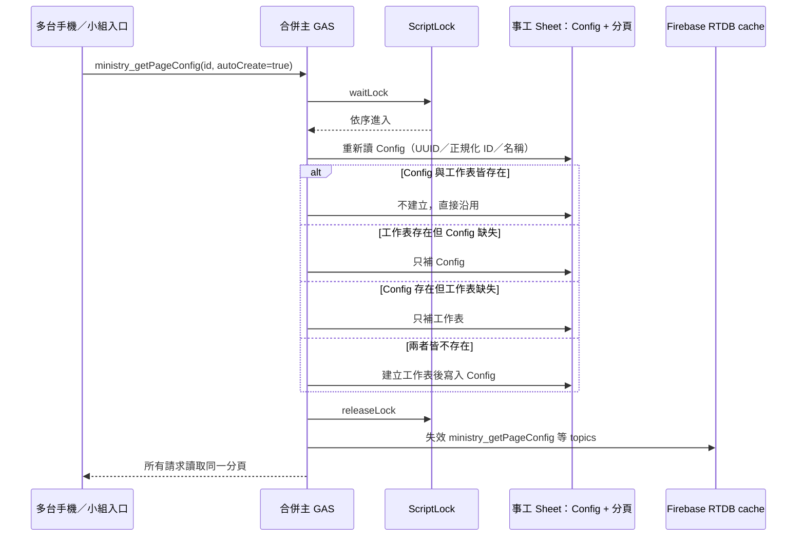

- ScriptLock 只保護同一個 GAS 專案；因此事工 Sheet 的寫入責任必須集中在合併主 GAS。舊獨立事工 GAS 若仍有寫入 trigger，應停用或改成只讀；若未來確實需要跨 GAS 專案共同寫入，才評估以 Firebase transaction 實作有租期的分散式鎖。

> 產生方式：使用 codebase MCP 對前端 `D:\program\Github\LKC1958_June_1.github.io` 與後端 `D:\program\LKC` 建立索引後，搭配實際入口檔案核對整理。
>
> 主要依據：
> - 前端中央路由：`config.js`
> - 後端合併主 GAS：`D:\program\LKC\主日出席_測試版\Core.js`
> - GAS 端 Firebase 同步：`D:\program\LKC\主日出席_測試版\FirebaseSync.js`
> - 各獨立 GAS 入口：`新家人管理系統/Code.js`、`奉獻管理系統/程式碼.js`、`車號查詢/core.js`、`週報管理系統/程式碼.js`、`兒童出席_GAS/Core.js`

## 1. 系統部署總覽

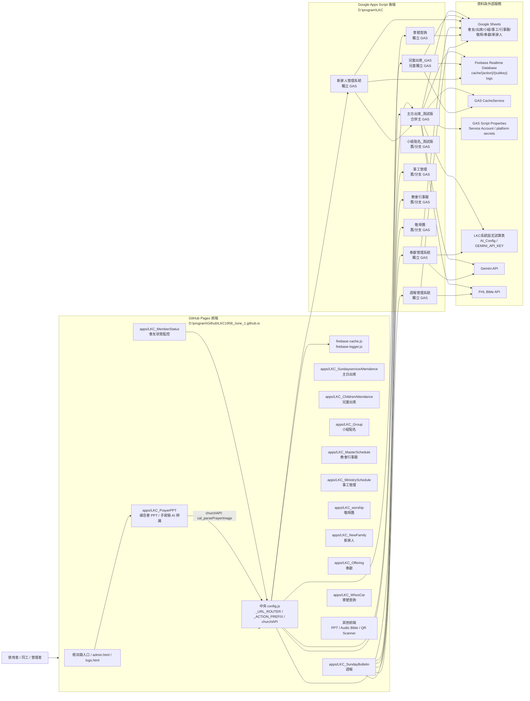

## 2. 前端中央 API 與快取流程

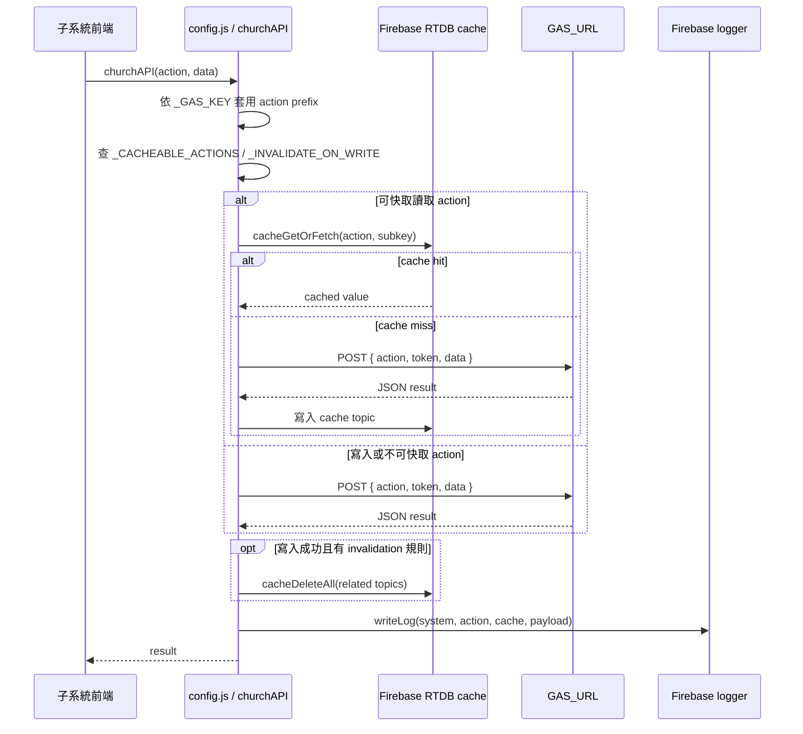

## 3. 合併主 GAS 後端分流

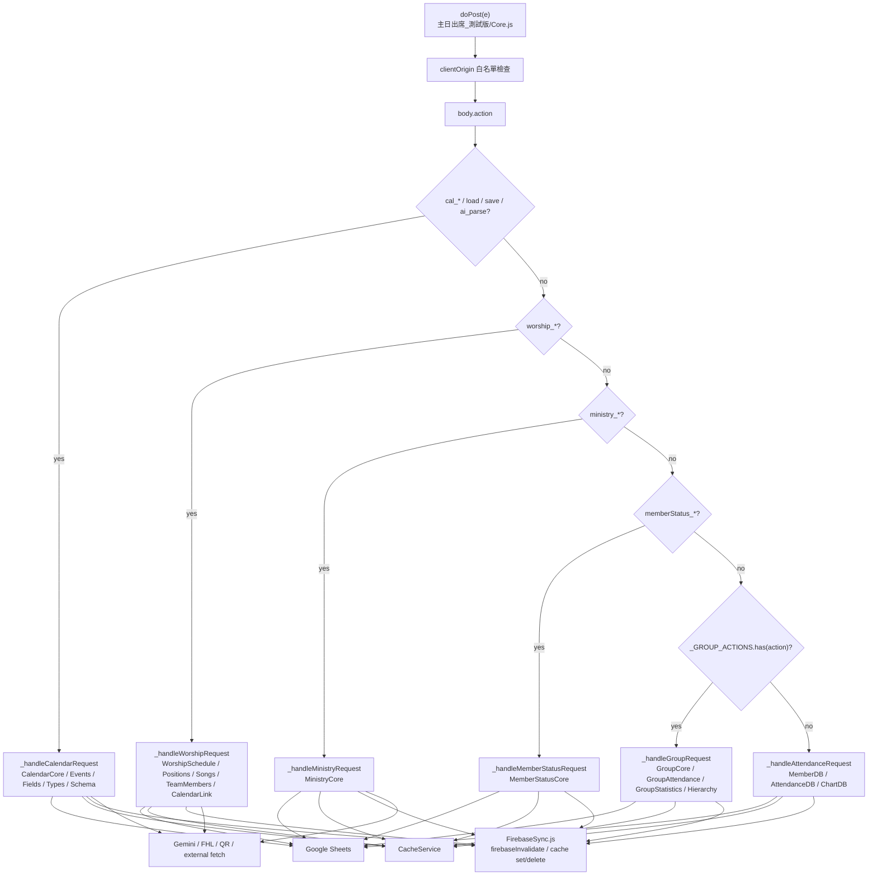

## 4. 子系統到 action contract 的關聯

```mermaid
flowchart TB
    subgraph FE["前端子系統"]
        Sunday["主日出席<br/>api.js / attendance.js / STATS.js"]
        Group["小組點名<br/>index.js / group.js / manage.js / stats.js"]
        Calendar["教會行事曆<br/>calendar.js / types.js"]
    Ministry["事工管理<br/>script.js"]
    Worship["敬拜團<br/>script.js / worship_songs.js"]
    MemberStatus["會友狀態監控<br/>index.html / script.js"]
    Children["兒童出席<br/>api.js / attendance.js / STATS.js"]
        NewFamily["新家人<br/>script.js"]
        Offering["奉獻<br/>js/api.js"]
        Bulletin["週報<br/>js/api.js"]
        Car["車號查詢<br/>index.html"]
    end

    subgraph Prefix["config.js action 前綴"]
        NoPrefix["無前綴<br/>主日/小組/奉獻/新家人/車號"]
        MinistryPrefix["ministry_*"]
        WorshipPrefix["worship_*"]
        MemberStatusPrefix["memberStatus_*"]
        ChildrenPrefix["children_*"]
        CalendarPrefix["cal_*"]
    end

    subgraph Backend["後端入口"]
        Main["合併主 GAS<br/>主日出席_測試版/Core.js"]
        ChildrenGAS["兒童出席_GAS/Core.js"]
        NewFamilyGAS["新家人管理系統/Code.js"]
        OfferingGAS["奉獻管理系統/程式碼.js"]
        CarGAS["車號查詢/core.js"]
        BulletinGAS["週報管理系統/程式碼.js"]
    end

    Sunday --> NoPrefix --> Main
    Group --> NoPrefix --> Main
    Calendar --> CalendarPrefix --> Main
    Ministry --> MinistryPrefix --> Main
    Worship --> WorshipPrefix --> Main
    MemberStatus --> MemberStatusPrefix --> Main
    Children --> ChildrenPrefix --> ChildrenGAS
    NewFamily --> NoPrefix --> NewFamilyGAS
    Offering --> NoPrefix --> OfferingGAS
    Car --> NoPrefix --> CarGAS

    Bulletin --> BulletinGAS
    Bulletin --> Main
    Bulletin --> MinistryPrefix
    Bulletin --> CalendarPrefix
    Bulletin --> WorshipPrefix
```

### 主要 action 分組

| 分組 | 前端來源 | 後端 handler | 代表 action |
|---|---|---|---|
| 主日出席 | `apps/LKC_SundayserviceAttendance` | `_handleAttendanceRequest` | `getAllMembers`, `getMemberManagementData`, `deleteMember`, `getSmartAttendanceList`, `saveAttendance`, `getAttendanceStats` |
| 小組點名 | `apps/LKC_Group` | `_handleGroupRequest` | `getGroups`, `verifyGroup`, `submitAttendance`, `getWeeklyReport`, `happyGroup_*` |
| 事工管理 | `apps/LKC_MinistrySchedule` | `_handleMinistryRequest` | `ministry_getGroups`, `ministry_getPageConfig`, `ministry_saveSheetData`, `ministry_savePageFieldConfig`, `ministry_saveGroupMembers`, `ministry_getGroupMembers` |
| 教會行事曆 | `apps/LKC_MasterSchedule` | `_handleCalendarRequest` | `cal_getTypes`, `cal_getFields`, `cal_getEvents`, `cal_addEvent`, `cal_queryBible` |
| 敬拜團 | `apps/LKC_worship` | `_handleWorshipRequest` | `worship_getSchedule`, `worship_getScheduleByDateRange`, `worship_getPositions`, `worship_getTeamMembers`, `worship_getSongs`, `worship_saveSchedule`, `worship_savePositions`, `worship_saveTeamMembers`, `worship_saveSongs` |
| 會友狀態監控 | `apps/LKC_MemberStatus` | `_handleMemberStatusRequest` | `memberStatus_getMembers`, `memberStatus_getProfile`, `memberStatus_getServiceIndex`, `memberStatus_refreshCaches` |
| 兒童出席 | `apps/LKC_ChildrenAttendance` | `兒童出席_GAS/Core.js` | `children_getAllMembers`, `children_getSmartAttendanceList`, `children_saveAttendance` |
| 新家人 | `apps/LKC_NewFamily` | `新家人管理系統/Code.js` | `getTrackingCases`, `getClosedCases`, `updateTrackingCase`, `closeCases` |
| 奉獻 | `apps/LKC_Offering` | `奉獻管理系統/程式碼.js` | `queryMemberOffering`, `adminAddOfferings`, `processReceiptImage`, `searchMemberCode` |
| 車號查詢 | `apps/LKC_WhosCar` | `車號查詢/core.js` | GET 車牌查詢 / keep alive |
| 週報 | `apps/LKC_SundayBulletin` | `週報管理系統/程式碼.js` + 多系統讀取 | 週報草稿/經文查詢/主日/小組/敬拜/行事曆聚合 |

### 近期更新關聯

| 系統 | 更新點 | 架構影響 |
|---|---|---|
| 事工管理 | 非 `小組聚會表模板` / `團契聚會表模板` 的事工頁面增加 `pageFieldConfig.scheduleMode`，可在 `schedule` 與 `membersOnly` 間切換 | `schedule` 沿用既有班表資料流；`membersOnly` 只維護 `ministry_saveGroupMembers` 成員名單，不讀班表。舊資料未設定時視為 `schedule`，保留既有行為 |
| 事工管理 | `ministry_savePageFieldConfig` 會保存 `scheduleMode` | 需要同步失效 `ministry_getPageConfig`、`ministry_getAggregatedReport` 與 `memberStatus_*`，避免會友狀態仍讀到舊模式 |
| 事工管理 | 小組入口自動建立改為鎖內冪等 ensure；定時同步共用同一 ScriptLock，並沿用小組 UUID | 多手機與定時 trigger 同時進入時只建立一份；工作表／Config 任一缺失時自動補齊，Firebase 仍只負責讀取快取與失效 |
| 敬拜團 | 管理端補強年度/季度排班、位置設定、團員名單、歌曲庫、行事曆連結快取操作 | `LKC_worship_TEST` 透過 `config.js` 加 `worship_` 前綴後進入合併主 GAS；位置/團員/歌曲各自對應 `worship_savePositions`、`worship_saveTeamMembers`、`worship_saveSongs` 與相關 cache topic |
| 敬拜團 | 會友狀態監控讀取敬拜團近一年服事 | `MemberStatusCore.js` 直接讀 `getScheduleByDateRange` 聚合敬拜團欄位；敬拜團班表或團員異動需失效 `memberStatus_getMembers`、`memberStatus_getProfile`、`memberStatus_getServiceIndex` |

## 5. Firebase / CacheService 失效關聯

### 主日／會員大會點名即時暫存資料流

```mermaid
flowchart LR
    Scanner[QR scanner / attendance.js] -->|Firebase ACK| Temp[Firebase RTDB<br/>attendanceTemp/{scope}/{UID}]
    Scanner -->|每 5 秒批次| Flush[GAS flushAttendanceTemp]
    Temp --> Flush
    Flush -->|script lock + idempotent upsert/delete| Sync[SYNC_TEMP]
    Sync -->|fallback / durable staging| Attendance[AttendanceDB / OfficialMemberDB]
    Temp -->|scope read| Viewer[getSmartAttendanceList / getAgmCheckinState]
    Flush -->|ETag If-Match ACK| Temp
```

| 點名元件 | Firebase scope / key | 後台批次 action | 失敗策略 |
|---|---|---|---|
| 一般 QR／手動點名 | `scope` + UID | `flushAttendanceTemp` → `SYNC_TEMP` | Firebase ACK 未到：前端最多保留 100 筆並重試 |
| 場次 QR／會員大會 | `AGM:<sessionId>` + UID | 同上，並保留 AGM leave guard | ETag 衝突不刪新資料，下一個 5 秒批次再處理 |
| 正式送出 | 同一 scope | 先 flush，再寫正式出席紀錄 | flush 失敗不清除暫存、不回報送出完成 |

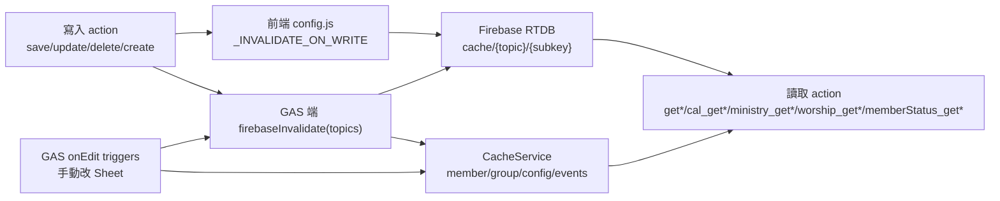

### 高影響失效主題

| 觸發來源 | 會影響的 cache topic |
|---|---|
| 會友名單異動 | `getAllMembers`, `getAllGroupMembers`, `getMemberSuggestions`, `getStats`, `ministry_getPageConfig`, `getSmartAttendanceList` |
| 小組名單/小組清單異動 | `getGroups`, `getAdminGroupsList`, `checkGroupStatus`, `ministry_getGroups`, `ministry_getGroupMembers` |
| 主日點名異動 | `getWeeklyReport`, `getAttendanceStats`, `getAttendanceTrend`, `getSmartAttendanceList`, `getCategoryChartData` |
| 小組點名異動 | `getWeeklyReport`, `getStats`, `getAllGroupsStats`, `checkGroupStatus` |
| 事工異動 | `ministry_getGroups`, `ministry_getAggregatedReport`, `ministry_getPageConfig`, `memberStatus_getMembers`, `memberStatus_getProfile`, `memberStatus_getServiceIndex` |
| 行事曆異動 | `cal_getTypes`, `cal_getFields`, `cal_getEvents`, `cal_getEvent`, `getSchedule`, `getScheduleByDateRange` |
| 敬拜團異動 | `worship_getSchedule`, `worship_getScheduleByDateRange`, `worship_getPositions`, `worship_getSongs`, `worship_getTeamMembers`, `memberStatus_getMembers`, `memberStatus_getProfile`, `memberStatus_getServiceIndex` |
| 會友狀態刷新 | `memberStatus_getMembers`, `memberStatus_getProfile`, `memberStatus_getServiceIndex`, `memberStatus_getDiscipleshipStatus` |
| 兒童出席異動 | `children_getAllMembers`, `children_getSmartAttendanceList`, `children_getAttendanceStats`, `children_getAttendanceTrend` |

### 會友刪除保護資料流

`members.html` 透過 `getMemberManagementData` 讀取快取會友名單，並由 `MemberDB.js` 即時掃描主日點名與小組成員名單產生 `usageByUid`。UID 若曾出現在主日點名紀錄（不含小組點名紀錄）、存在於小組成員名單（`*_名單`），或主檔已有小組欄位，即標記為 `effective`。前端顯示「有效」並停用刪除；即使繞過前端直接呼叫 `deleteMember`，後端仍會在持有 ScriptLock 時重新掃描並拒絕硬刪除，只保留改為「不統計」的操作。

## 6. 資料儲存與跨系統讀取

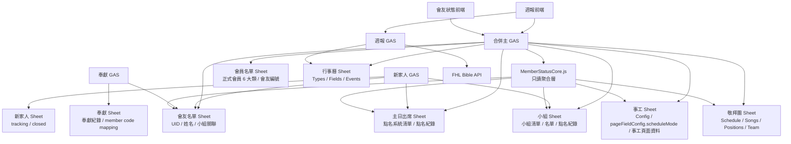

### 主日會員名單與統計基準

`members.html` 的「常態會友名單」以 `getMemberManagementData` 讀取 `會友名單`；「和會獨立會員名單」以 `getOfficialMembers` 讀取 `會員名單`，並以預置基準資料補足部分回應。`STATS.html` 的 `baseSheet` 會傳入 `ReportService.getAttendanceStats`／`getAttendanceTrend`，後端依所選工作表的實際欄位（`姓名／系統編號` 或 `會員姓名／會友編號`）正規化後，再以 UID 對應主日點名紀錄。

## 7. codebase MCP 索引狀態

| Repo | MCP project | 索引模式 | 結果 |
|---|---|---|---|
| `D:\program\Github\LKC1958_June_1.github.io` | `D-program-Github-LKC1958_June_1.github.io` | `moderate` | 已索引，約 2007 nodes / 5342 edges |
| `D:\program\LKC` | `D-program-LKC` | `moderate` | 已索引，約 155 nodes / 162 edges |

注意：後端 `D:\program\LKC` 有大量 Apps Script / 中文目錄 / `.gs` 檔，codebase MCP 對符號層解析較少，因此本圖的後端 action 分流另外用實際入口檔案核對。前端 repo 的函式與 API wrapper 解析較完整。

## 8. 會友狀態監控讀取策略

`apps/LKC_MemberStatus` 是只讀監控系統，不寫回任何來源系統。後端由 `D:\program\LKC\主日出席_測試版\MemberStatusCore.js` 聚合資料，經 `memberStatus_*` actions 暴露。

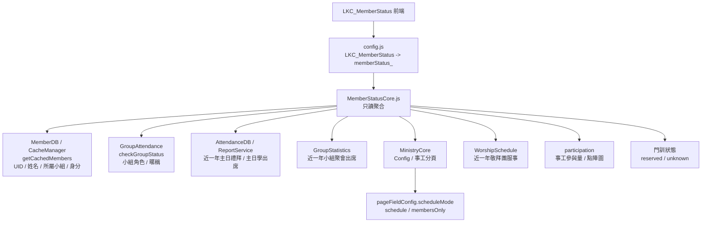

| 來源 | v1 讀取規則 |
|---|---|
| 主日會友名單 | `UID` 為主鍵，姓名只作顯示與 fallback |
| 會友名單狀態 | `不列入統計` / `不統計` 的會友不進入會友狀態監控、不參與篩選與圖表 |
| 小組/團契歸屬 | 使用會友 cache 的 `所屬小組` + `身分` |
| 主日禮拜出席 | 讀近一年 `台語點名紀錄` / `華語點名紀錄` / `聯合點名紀錄`，計算 `count / total / rate / lastDate` |
| 主日學出席 | 讀近一年名稱含 `主日學` 的點名紀錄，計算 `count / total / rate / lastDate` |
| 小組聚會出席 | 讀近一年 `*_點名紀錄`，只對會友目前分屬小組/團契計算出席摘要 |
| 事工系統：`小組聚會表模板` / `團契聚會表模板` | 讀名單 + 近一年班表，統計小組/團契服事 |
| 事工系統：非小組聚會模板 + `scheduleMode=schedule` 或舊資料未設定 | 讀名單 + 近一年班表，統計教會事工服事；`姓名` / `成員` 等名單欄位不當作服事欄位 |
| 事工系統：非小組聚會模板 + `scheduleMode=membersOnly` | 只讀名單，判斷是否屬於該教會事工；不讀班表 |
| 敬拜團 | 讀近一年 `getScheduleByDateRange` 服事紀錄；前端經 `worship_getScheduleByDateRange` 讀取，會友狀態後端在合併主 GAS 內直接呼叫同一組函式 |
| 事工參與量 | `groupMinistries + churchMinistries + worship.positions` 產生 `participation`；前端點陣圖預設顯示排序前 24 位，點擊「顯示完整 N 人」後呈現目前篩選結果的完整名單 |
| 前端請求時機 | 首次載入只呼叫 `memberStatus_getMembers`；使用者點選會友後才呼叫 `memberStatus_getProfile`，避免首屏額外等待一次 GAS 往返 |
| 門訓 | 保留 `discipleship` 欄位，第一版回 `unknown` |
| 無法配對姓名 | 放入 `unresolvedParticipants`，不硬配 UID |

## 禮拜PPT產生器（台語／聯合華語）

子系統的完整技術架構、模組責任、資料契約、失敗回退與多模板擴充原則，統一維護於 [`apps/LKC_WorshipPPT/ARCHITECTURE.md`](../apps/LKC_WorshipPPT/ARCHITECTURE.md)。本節只保留跨系統關係摘要。

```text
admin.html → apps/LKC_WorshipPPT/
禮拜PPT產生器 → localStorage 草稿 + 16:9 即時預覽
禮拜PPT產生器 → template-profiles.js → 台語或聯合－華語 sections／固定頁／資料需求／母片資產／檔名前綴
禮拜PPT產生器 → firebase/firebase-config-values.js 共用 bootstrap → 絕對 gstatic SDK URL → layout-cloud-store.js（避免 `about:blank` 或 `file://` 下的相對動態 import 解析失敗）
禮拜PPT產生器 → `worship-ppt-supabase.js` → Supabase `calendar_events`（行事曆；缺資料時回主 GAS）
禮拜PPT產生器 → Supabase `worship_ppt_library_index`（只讀 PPT Library 索引：kind / number / title / fileId）
禮拜PPT產生器 → config.js / read-api.js → 主 GAS `LKC_WorshipPPT` `cal_queryBible` / 行事曆備援
禮拜PPT產生器 → config.js / read-api.js → Library GAS `LKC_WorshipPPT_LIBRARY` `cal_getPptLibraryIndex`（索引備援） / `cal_getPptLibraryFile`（fileId → PPTX）
禮拜PPT產生器 → 週報管理系統 GAS `load` → `reports_YYYY-MM-DD`（本會消息／教界消息／關懷代禱，依序產生報告頁）
禮拜PPT產生器 → 週報管理系統 GAS `load` → `praise_songs_YYYY-MM-DD`（聖歌隊讚美）
禮拜PPT產生器（file:// 或 POST 被擋）→ read-api.js JSONP → 對應的主 GAS／Library GAS 唯讀 action
Library GAS → Google Drive 聖詩／啟應文資料夾（依 fileId 讀取原始 PPTX）
禮拜PPT產生器（聯合華語）→ `templates/` 三張 16:9 PNG → 全心敬拜／奉獻／獻上感恩完整圖像頁（不拆字、不呼叫 GAS）
禮拜PPT產生器 → 索引命中 fileId → Library GAS `cal_getPptLibraryFile` → 原始台語聖詩／啟應文 PPTX Base64
禮拜PPT產生器 → pptx-library.js（瀏覽器內解析圖片、文字、座標與 PowerPoint `srcRect` 正／負裁切；樂譜／啟應文依來源與目的矩形點陣化為透明整頁 PNG）
禮拜PPT產生器 → bulletin-content.js（本會消息、教界消息、關懷代禱依有效字級、內容框寬高、行距及輸出比例動態分頁；不保存估算軟換行，超長單項才產生續頁）
禮拜PPT產生器 → source-reminders.js（帶入完成後以一次非阻擋警告視窗，列出空白的行事曆欄位、週報分類／讚美、經文查詢或找不到的 PPT 素材）
禮拜PPT產生器 → LKC_ppt_generator/bible-service.js（經文代號解析；profile 決定 `tghg` 或 `tghg`＋`unv`）
禮拜PPT產生器 → slide-production.js（全文分頁；聯合華語信經／主禱文保留左右兩個獨立文字框）
禮拜PPT產生器 → layout-groups.js（勾選頁面＋具名參數群組；報告版面異動或雲端版面載入時觸發重新分頁）
禮拜PPT產生器 → Firebase RTDB `worshipPpt/layoutConfig/shared`（需 Auth 解鎖寫入的共用版面；localStorage 保存離線備份與待同步狀態）
禮拜PPT產生器（聯合華語）→ Firebase RTDB `worshipPpt/layoutConfig/templates/joint-mandarin`（與台語 page assignments 隔離）
禮拜PPT產生器（聯合台語）→ Firebase RTDB `worshipPpt/layoutConfig/templates/joint-taiwanese`（首次無設定時讀取台語 `shared` 作為初始 clone，但信仰告白／主禱文排除台語 assignment，改用聯合華語雙欄模板參數；保存後獨立）
禮拜PPT產生器 → ppt-export.js / PptxGenJS（匯出前重新確認報告分頁，再產生完整禮拜 PPTX）
```

- 禱告會 PPT 使用中央路由 key `LKC_PrayerPPT` 指向合併主 GAS，不沿用舊獨立行事曆的 `LKC_MasterSchedule`；瀏覽器不保存或直連 Gemini key。前端支援一次選取或拖入多張圖片，依序以 `cal_parsePrayerImage` 送至合併主 GAS 並顯示逐張進度；每張 AI 文字在自己的圖片邊界內解析，先排除頁尾頁碼與下一頁前言滲入，再合併結構化禱告段落，因此上傳順序不會污染前一段，重複出現的同編號段落則採追加內容。OCR 對「經文」與「金句」區塊僅回傳可辨識的書卷、章、節代號；PrayerPPT 再從文字中抽取代號並交給既有聖經 API 填入全文，不會把手寫經文本身當成查詢字串。投影片以 1～13 大項分組，同一大項內的小點會在可用行數內合併排版；放不下的小點整體移到下一頁，只有單一小點本身超長時才續頁。PrayerPPT 使用與其他崇拜模板共用的版面群組介面，並實作相同的群組建立、頁面歸屬與套用能力；設定依 template ID 同步。PrayerPPT 預設白色背景搭配深色標題／內文。後端由 `CalendarCore.js` 呼叫 `GeminiHelper.js`，再從「LKC系統設定」試算表的 `AI_Config` 讀取 `GEMINI_API_KEY`。

行事曆帶入先由 `worship-ppt-supabase.js` 讀取 Supabase；缺資料或讀取失敗時回到主 GAS，依 active profile 嚴格選取同日期的 `講道資訊-台語`、`講道資訊-聯合-台語` 或 `講道資訊-聯合-華語`。PPT Library 索引先讀 Supabase `worship_ppt_library_index`，缺索引時才回到 Library GAS；索引命中後只把 `fileId` 傳給 `cal_getPptLibraryFile` 取回原始 PPTX，Supabase 不保存 binary，瀏覽器也不直接讀 Storage／Drive。聖經由主 GAS `cal_queryBible` 提供；本會消息、教界消息、關懷代禱與讚美由週報 Supabase 優先、週報 GAS `load` 備援，不經過 `worshipPpt/content` Firebase 鏡像。由 `file://` 直接開啟或 POST 遭跨來源政策拒絕時，`read-api.js` 對四個唯讀 action 使用 JSONP，PPT Library action 固定送往 Library GAS，不會落到主 GAS。映射結果先成為 `sourceValue`：講題與講員可直接顯示；宣召、經文與金句由瀏覽器解析範圍後依 profile 查詢台語或華語聖經全文並分頁。台語與聯合台語模板使用聖詩／啟應文 Library；聯合台語的宣召、信仰告白、主禱文、經文與金句為台華雙語，雙欄禮文沿用聯合華語版型。聯合華語的全心敬拜、奉獻與獻上感恩直接使用專案內三張 16:9 PNG 原圖，完整保留圖片中的文字排版、背景與視覺效果，不再依賴外部簡報或 GAS。每張產生後的投影片具有穩定 `pageId`，使用者可將不同勾選批次存成具名版面群組；群組參數與頁面歸屬按 template ID 同步到 Firebase，並以不同 localStorage key 保存草稿與待同步狀態。

### 多模板擴充邊界（台語、聯合台語與聯合華語已實作）

「台語」、「聯合－台語」與「聯合－華語」共用資料回退、PPTX／OOXML 解析、Canvas 點陣化、報告動態分頁、deck/page ID、版面群組與 PptxGenJS 匯出核心；流程段落、行事曆 selector、聖經版本、固定禮文、固定素材、預設版面、來源需求與輸出檔名由 declarative template profile 提供。模板版面已分為既有 `worshipPpt/layoutConfig/shared` 與 `worshipPpt/layoutConfig/templates/{templateId}`；聯合台語僅在尚無專屬設定時以台語版面作為初始 fallback。內容維持由既有行事曆／週報 API 直接提供，不建立 `worshipPpt/content` 重複鏡像；若未來需要離線快照，另行評估獨立的快取策略。

## 台語有聲聖經時間軸與播放管線資料流（2026-09）

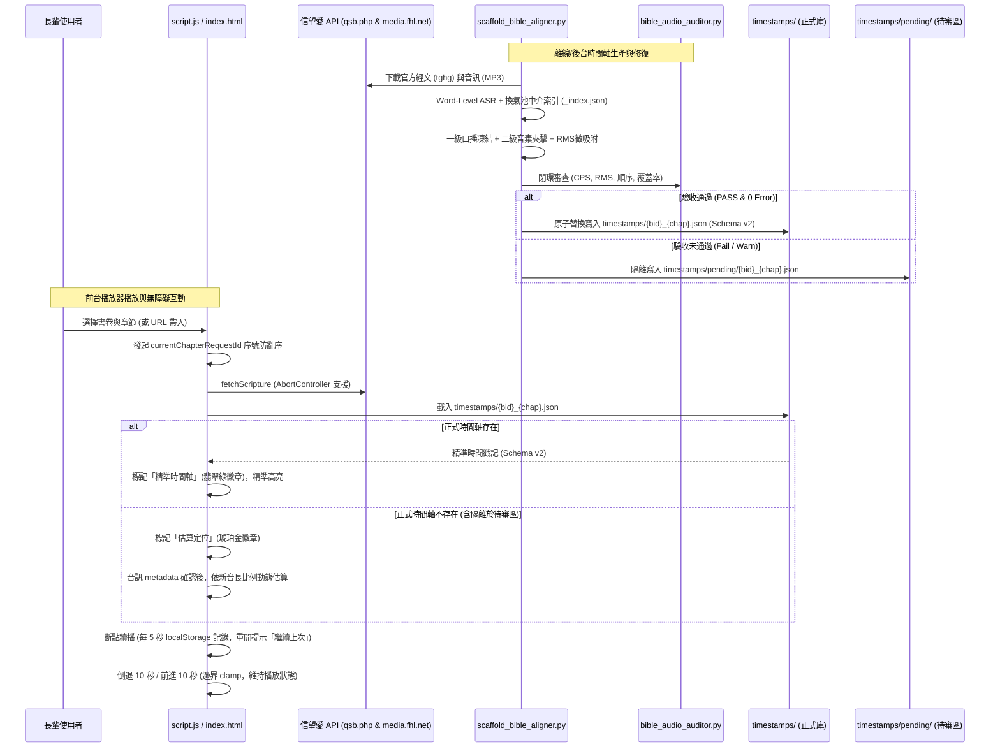

- **管線隔離保證**：未通過 `BibleAudioAuditor` 門檻的產物嚴格限制於 `timestamps/pending/`，絕不寫入或殘留於 `timestamps/`。
- **播放版本隔離**：華語朗讀版本（`audioVer === '0'`）嚴格拒絕載入台語時間軸，切換至動態估算定位。
- **異步防競爭**：經文與時間軸載入採用最新序號守衛（`requestId`）與 `AbortController`，舊請求回應一律靜默丟棄。
